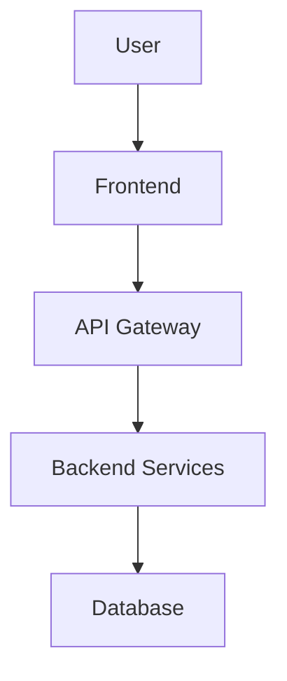

# Sample Architecture Diagram

**Type**: Flowchart
**Description**: System architecture overview showing data flow

## Diagram Code

## Visual Representation
> To render this diagram, copy the code above and paste it into:
> - [Mermaid Live Editor](https://mermaid.live/)
> - GitHub/GitLab markdown files
> - VS Code with Mermaid extension

---
*Test diagram created on 2025-09-26T06:08:33.742Z*
