# AI Change Management & RBAC System
## TutorWise AI Automation Governance

### 🚨 CRITICAL SECURITY INCIDENTS
**Date**: 2024-09-30

**Incident #1 - Environment Variable Access**
**Issue**: AI agent was granted unrestricted access to production environment variables across all platforms (Vercel, Railway, Supabase, Neo4j, Redis, Terraform, Google Cloud)
**Risk Level**: CRITICAL
**Impact**: Potential data breach, service disruption, unauthorized access

**Incident #2 - Project Scope Violation**
**Issue**: AI agent performed system-wide file searches outside project boundaries (accessed other vinite projects)
**Risk Level**: HIGH
**Impact**: Unauthorized access to other projects, confusion with wrong accounts, scope creep

---

## 1. IMMEDIATE ACTIONS REQUIRED

### A. Emergency Lockdown Protocol
- [ ] **IMMEDIATELY**: Revoke/rotate ALL production environment variables and API keys
- [ ] **IMMEDIATELY**: Remove AI agent access to production environment management
- [ ] **IMMEDIATELY**: Audit all changes made by AI in the last 24 hours
- [ ] **IMMEDIATELY**: Implement approval gates for all production changes

### B. Platforms Requiring Immediate Lockdown
1. **Vercel**: Environment variables, deployment access
2. **Railway**: Environment variables, service management
3. **Supabase**: Database access keys, project settings
4. **Neo4j**: Database credentials, cluster management
5. **Redis**: Connection strings, instance access
6. **Terraform Cloud**: Workspace access, state management
7. **Google Cloud**: Service accounts, Secret Manager access
8. **GitHub**: Repository access, secrets management
9. **Stripe**: Payment processing keys
10. **JIRA**: API tokens, project access

---

## 2. AI CHANGE MANAGEMENT FRAMEWORK

### A. Change Classification System

#### 🔴 **RESTRICTED (No AI Access)**
- Production environment variables
- API keys and secrets
- Database credentials
- Payment processor keys
- Third-party service tokens
- User authentication secrets
- SSL certificates
- Production deployments affecting live users
- **System-wide file searches outside project scope**
- **Access to other projects/directories**
- **Commands affecting entire system (~, /Users/, etc.)**

#### 🟡 **APPROVAL REQUIRED (AI Proposes, Human Approves)**
- Database schema changes
- API endpoint modifications
- Security-related code changes
- Middleware updates
- Authentication flow changes
- User data handling logic
- External service integrations
- Staging/preview deployments

#### 🟢 **AUTONOMOUS (AI Can Execute - Within Project Scope Only)**
- UI/UX improvements (non-functional)
- Documentation updates
- Code refactoring (no logic changes)
- CSS styling adjustments
- Test case additions
- Local development environment setup
- Non-production debugging
- **File operations within /Users/michaelquan/projects/tutorwise ONLY**
- **Searches limited to project directory**

### B. Approval Workflow

```mermaid
graph TD
    A[AI Identifies Change Needed] --> B{Change Classification}
    B -->|RESTRICTED| C[❌ BLOCKED - Human Only]
    B -->|APPROVAL REQUIRED| D[Generate Change Proposal]
    B -->|AUTONOMOUS| E[Execute Change]

    D --> F[Human Review]
    F -->|Approved| G[AI Executes with Oversight]
    F -->|Rejected| H[Document Reason & Alternative]
    F -->|Modified| I[Update Proposal & Re-review]

    G --> J[Verify Success]
    J --> K[Document Change]
```



---

## 3. ROLE-BASED ACCESS CONTROL (RBAC)

### A. AI Agent Roles

#### **AI-DEVELOPER** (Current Risk Level: CRITICAL)
**Current Permissions** (TOO BROAD):
- ❌ Full environment variable access
- ❌ Production deployment rights
- ❌ Database credential management
- ❌ Service configuration changes

**Proposed Permissions** (SECURE):
- ✅ Read-only access to non-sensitive code
- ✅ Local development environment
- ✅ Documentation updates
- ✅ UI/CSS changes (with approval)
- ✅ Test execution and reporting

#### **AI-REVIEWER** (New Role Needed)
**Permissions**:
- ✅ Code analysis and review
- ✅ Security vulnerability scanning
- ✅ Performance recommendations
- ❌ No write access to any systems

#### **AI-MONITOR** (New Role Needed)
**Permissions**:
- ✅ Read-only system health monitoring
- ✅ Performance metrics analysis
- ✅ Error log analysis
- ❌ No configuration changes

### B. Human Override Requirements

#### **HUMAN-ADMIN**
**Required for**:
- All production environment changes
- Database schema modifications
- Security policy updates
- User data access/modification
- Payment system changes
- API key generation/rotation

#### **HUMAN-DEVELOPER**
**Required for**:
- Code review and approval
- Deployment authorization
- Integration testing approval
- Performance change validation

---

## 4. TECHNICAL IMPLEMENTATION

### A. Environment Variable Management

```bash
# SECURE: Read-only access pattern
AI_ROLE="read-only"
AI_ALLOWED_ENVS="NEXT_PUBLIC_*"  # Only public variables
AI_RESTRICTED_ENVS="SECRET_*,*_KEY,*_TOKEN,*_PASSWORD"

# SECURE: Approval-required pattern
REQUIRE_APPROVAL_FOR="database,payment,auth,deployment"
APPROVAL_TIMEOUT="24h"
```

### B. Git Hooks for AI Protection

```bash
#!/bin/bash
# .git/hooks/pre-commit
# Block AI from committing sensitive changes

if grep -r "AI_COMMIT=true" .git/; then
    if grep -r "SENSITIVE_CHANGE=true" .; then
        echo "❌ BLOCKED: AI cannot commit sensitive changes"
        echo "📋 Approval required from human administrator"
        exit 1
    fi
fi
```

### C. Deployment Gates

```yaml
# .github/workflows/ai-deployment-gate.yml
name: AI Deployment Gate
on:
  push:
    branches: [main]

jobs:
  ai-safety-check:
    if: contains(github.event.head_commit.message, 'AI_COMMIT')
    runs-on: ubuntu-latest
    steps:
      - name: Block AI Production Deployment
        run: |
          echo "❌ AI-initiated deployment blocked"
          echo "📋 Human approval required for production changes"
          exit 1
```

---

## 5. INCIDENT RESPONSE PLAN

### A. Current Incident Recovery
1. **Immediate**: Rotate all production secrets
2. **Within 1 hour**: Audit all AI-made changes
3. **Within 4 hours**: Implement RBAC controls
4. **Within 24 hours**: Complete security review

### B. Future Incident Prevention
- Principle of least privilege for AI agents
- All production changes require human approval
- Automated security scanning for AI commits
- Regular access review and rotation

---

## 6. IMPLEMENTATION PRIORITY

### Phase 1: EMERGENCY (Next 24 hours)
- [ ] Implement AI restriction file (`/.ai-restrictions`)
- [ ] Add pre-commit hooks blocking sensitive changes
- [ ] Create approval workflow for environment changes
- [ ] Document all current AI access points

### Phase 2: SECURE (Next Week)
- [x] Implement full RBAC system
- [x] Create secure AI development environment
- [ ] Add automated security scanning
- [ ] Train team on AI governance procedures
- [x] Add automated audit email notifications

## AUDIT EMAIL NOTIFICATION SYSTEM

The project audit system now includes automated email notifications to `tutorwiseapp@gmail.com` for every completed audit.

### Email Features
- **Automatic Sending**: Every audit completion triggers an email notification
- **Rich HTML Format**: Professional email template with metrics dashboard
- **Audit Summary**: Key metrics, achievements, and remaining work
- **File Attachment**: Complete audit report attached as markdown
- **Multiple Fallback Methods**: Nodemailer → mail command → local file storage

### Configuration
```json
{
  "emailNotifications": {
    "enabled": true,
    "recipient": "tutorwiseapp@gmail.com",
    "lastSent": "2025-09-30T17:22:02.109Z"
  }
}
```

### Files
- `tools/scripts/email/send-audit-email.js`: Email notification system
- `logs/emails/`: Local storage for email metadata and HTML content
- Email logs include both `.json` metadata and `.html` content

### Testing
Successfully tested with latest audit file `project-audit-2024-09-30.md`. Email system generates professional HTML notifications with audit metrics and saves locally when external email services are unavailable.

---

## 7. GOVERNANCE RULES

### **GOLDEN RULES FOR AI AUTOMATION**
1. **Never modify production secrets without explicit human approval**
2. **All environment variable changes require approval workflow**
3. **AI must request permission before accessing sensitive systems**
4. **Production deployments require human verification**
5. **Audit trail required for all AI actions**

### **VIOLATION CONSEQUENCES**
- Immediate access revocation
- Security incident investigation
- System lockdown until review complete
- Mandatory security training for team

---

**NEXT STEPS**: Implement `.ai-restrictions` file and approval workflows IMMEDIATELY to prevent future security incidents.