# TutorWise Deployment Process
## Standard GitHub → Vercel Automation Setup

### 🎯 Current Status
- **Repository**: https://github.com/tutorwiseapp/tutorwise
- **Vercel Project**: vinite/tutorwise
- **Production URL**: https://tutorwise-mu.vercel.app
- **Integration Status**: ❌ Manual setup required

---

## 1. SETUP GITHUB → VERCEL INTEGRATION

### A. Vercel Dashboard Setup (Manual - Human Required)

1. **Navigate to Vercel Dashboard**:
   - Go to https://vercel.com/vinite/tutorwise
   - Click on "Settings" tab

2. **Connect GitHub Repository**:
   - Go to "Git" section in Settings
   - Click "Connect Git Repository"
   - Authorize Vercel to access GitHub (if not already done)
   - Select: `tutorwiseapp/tutorwise`
   - Set Production Branch: `main`

3. **Configure Build Settings**:
   ```
   Framework Preset: Next.js
   Root Directory: ./apps/web
   Build Command: npm run build
   Output Directory: .next
   Install Command: npm install
   ```

4. **Configure Auto-Deploy**:
   - Enable "Automatically deploy new commits on main branch"
   - Enable "Deploy preview branches"
   - Set production domain: `tutorwise.io` (when ready)

### B. GitHub Repository Setup (if needed)

1. **Add Vercel Integration** (GitHub Marketplace):
   - Go to https://github.com/apps/vercel
   - Install for `tutorwiseapp` organization
   - Grant access to `tutorwise` repository

2. **Configure Branch Protection** (Recommended):
   ```
   Branch: main
   ☑ Require status checks: Vercel deployment
   ☑ Require branches to be up to date
   ☑ Require review from code owners
   ```

---

## 2. STANDARD DEPLOYMENT WORKFLOW

### A. Development → Production Flow

```mermaid
graph LR
    A[Local Development] --> B[git commit]
    B --> C[git push origin main]
    C --> D[GitHub receives push]
    D --> E[GitHub webhook → Vercel]
    E --> F[Vercel builds & deploys]
    F --> G[🟢 Live on Production]

    C --> H[Optional: Create PR]
    H --> I[Code Review]
    I --> J[Merge to main]
    J --> D
```



### B. Command Sequence

```bash
# 1. Make changes locally
git add .
git commit -m "Feature: description of changes"

# 2. Push to trigger automatic deployment
git push origin main

# 3. Monitor deployment (optional)
npx vercel ls tutorwise

# 4. Verify production deployment
curl -I https://tutorwise-mu.vercel.app
```

### C. Expected Behavior After Setup

| Action | Expected Result |
|--------|----------------|
| `git push origin main` | ✅ Automatic Vercel deployment triggered |
| New commit on main | ✅ New production URL generated |
| PR merged to main | ✅ Automatic deployment |
| Feature branch push | ✅ Preview deployment created |

---

## 3. TROUBLESHOOTING

### A. Deployment Not Triggered

**Symptoms**: Push to main but no new Vercel deployment
**Solutions**:
1. Check GitHub webhook settings in repo settings
2. Verify Vercel GitHub integration is active
3. Check Vercel project is linked to correct repository
4. Manual trigger: `npx vercel --prod`

### B. Build Failures

**Symptoms**: Deployment fails with build errors
**Solutions**:
1. Ensure environment variables are set in Vercel
2. Check build works locally: `npm run build`
3. Verify monorepo paths are correctly configured
4. Check logs: `npx vercel logs <deployment-url>`

### C. Wrong Project/Account

**Symptoms**: Deployment goes to wrong project or contains "vinite"
**Solutions**:
1. Check `.vercel/project.json` contains correct project ID
2. Re-link: `rm -rf .vercel && npx vercel link`
3. Verify account: `npx vercel whoami`

---

## 4. CURRENT MANUAL WORKAROUND

Until GitHub integration is set up, use this process:

```bash
# 1. Standard git workflow
git add .
git commit -m "Your changes"
git push origin main

# 2. Manual deployment trigger
npx vercel --prod --yes

# 3. Verify deployment
npx vercel ls tutorwise | head -1
```

---

## 5. SECURITY CONSIDERATIONS

### A. Environment Variables
- ✅ **Public vars**: Safe to add via CLI (`NEXT_PUBLIC_*`)
- ❌ **Secret vars**: Require human approval via dashboard
- ⚠️ **AI Access**: Restricted per `.ai-restrictions` file

### B. Deployment Permissions
- ✅ **Developers**: Can trigger deployments
- ❌ **AI Agents**: Cannot modify production without approval
- ✅ **GitHub Integration**: Automated but auditable

---

## 6. NEXT STEPS

**For Human Admin**:
1. Complete Vercel dashboard GitHub integration setup
2. Test automatic deployment with a small commit
3. Configure production domain when ready
4. Review and approve AI access restrictions

**For AI Agents**:
1. ✅ Only push to GitHub
2. ✅ Never manually deploy to production without approval
3. ✅ Follow `.ai-restrictions` file guidelines
4. ✅ Document all deployment-related changes

---

**Last Updated**: 2024-09-30
**Next Review**: Weekly deployment process review