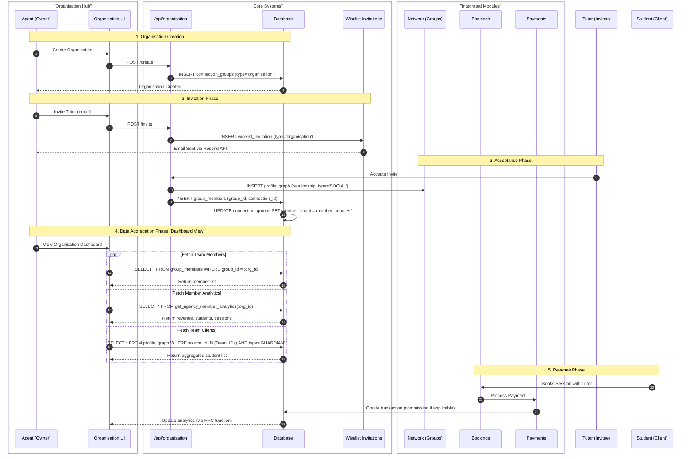

# Organisation Feature - Solution Design

**Version**: v6.1
**Date**: 2025-12-12
**Status**: Active
**Owner**: Senior Architect
**Dependencies**: v4.4 (Network Groups), v4.6 (Profile Graph), v5.0 (Wiselist Invitations), v3.2 (Hub Architecture)
**Reference**: organisation-solution-design-v6.md

---

## Executive Summary

This document details the architecture for the **Organisation Hub** (`/organisation`). The system enables multi-user business management for tutoring agencies, schools, and enterprises through a "Virtual Entity" model.

### Strategic Shift

We are moving beyond the "Solo Tutor" model to support Multi-User Businesses. By introducing the "Organisation" entity as a special-purpose connection group, we support three key personas with a single unified feature:

1. **Tutoring Agencies**: An Agent managing a roster of Tutors
2. **Schools**: A Headteacher managing Teachers and Students
3. **Enterprises**: L&D departments managing Trainers and Employees

### The Solution

We do NOT create a complex new "Organisation User Type." Instead, we **upgrade the existing Network Groups system** (v4.4) to support "Business Identities." An organisation is simply a special type of Group (`connection_groups.type = 'organisation'`) that owns branding, invites members, and aggregates data.

**Why this wins**:
- **Reuse**: Leverages `connection_groups` table (v4.4) and `wiselist_invitations` (v5.0)
- **Flexibility**: A user can own multiple organisations
- **Simplicity**: No separate authentication layer needed

---

## Architecture & Data Model

### 1. The "Virtual Entity" Model

An Organisation is a data container owned by a User (`profile_id`). It is not a separate login entity.

**Entity Relationship Diagram (ASCII)**:

```
┌─────────────────────┐
│  User: Agent        │
│  (profile_id)       │
│  roles: ['agent']   │
└──────────┬──────────┘
           │ owns (profile_id)
           ▼
┌─────────────────────────────┐
│  connection_groups          │
│  type='organisation'        │
│  ├─ id (UUID)               │
│  ├─ profile_id (owner)      │
│  ├─ name                    │
│  ├─ slug                    │
│  ├─ avatar_url              │
│  ├─ description             │
│  ├─ website                 │
│  ├─ member_count            │
│  └─ settings (JSONB)        │
│     └─ default_commission   │
└──────────┬──────────────────┘
           │ contains (1:N)
           ▼
┌─────────────────────────────┐
│  group_members              │
│  ├─ group_id (FK)           │
│  ├─ connection_id (FK)      │
│  ├─ added_at                │
│  ├─ commission_rate         │  ← Individual override
│  ├─ internal_notes          │  ← Private to owner
│  └─ is_verified             │  ← DBS/ID status
└──────────┬──────────────────┘
           │ references
           ▼
┌─────────────────────────────┐
│  profile_graph              │
│  relationship_type='SOCIAL' │
│  Agent ←→ Tutor             │
│  ├─ id (UUID)               │
│  ├─ source_profile_id       │  ← Agent
│  ├─ target_profile_id       │  ← Tutor
│  └─ created_at              │
└─────────────────────────────┘
           │
           │ Tutor also has
           ▼
┌─────────────────────────────┐
│  profile_graph              │
│  relationship_type=         │
│  'GUARDIAN'                 │
│  Tutor ←→ Student           │
│  ├─ source_profile_id       │  ← Tutor (member)
│  └─ target_profile_id       │  ← Student (client)
└─────────────────────────────┘
```

### 2. Profile Graph Integration

We leverage the **v4.6 Profile Graph** to map the relationships:

- **Agent-Tutor**: Stored in `profile_graph` (`relationship_type='SOCIAL'`)
- **Tutor-Student**: Stored in `profile_graph` (`relationship_type='GUARDIAN'`)
- **Agent-Student**: **Derived Relationship** - The Agent "sees" a student if *any* of its Tutors has a link to that student in the `profile_graph`

This creates a two-hop relationship graph:
```
Agent → (SOCIAL) → Tutor → (GUARDIAN) → Student
```

The Clients tab aggregates all students by:
1. Get all member IDs from `group_members`
2. Query `profile_graph` for GUARDIAN relationships where `source_profile_id IN (member_ids)`
3. Return unique students

---

## Database Schema Design

### 1. Migration: `091_upgrade_network_groups.sql`

```sql
-- Upgrade connection_groups to support business identities
ALTER TABLE public.connection_groups
ADD COLUMN IF NOT EXISTS type TEXT CHECK (type IN ('personal', 'organisation')) DEFAULT 'personal',
ADD COLUMN IF NOT EXISTS slug TEXT UNIQUE,
ADD COLUMN IF NOT EXISTS avatar_url TEXT,
ADD COLUMN IF NOT EXISTS description TEXT,
ADD COLUMN IF NOT EXISTS website TEXT,
ADD COLUMN IF NOT EXISTS contact_name TEXT,
ADD COLUMN IF NOT EXISTS contact_email TEXT,
ADD COLUMN IF NOT EXISTS contact_phone TEXT,
ADD COLUMN IF NOT EXISTS address_line1 TEXT,
ADD COLUMN IF NOT EXISTS address_town TEXT,
ADD COLUMN IF NOT EXISTS address_city TEXT,
ADD COLUMN IF NOT EXISTS address_postcode TEXT,
ADD COLUMN IF NOT EXISTS address_country TEXT,
ADD COLUMN IF NOT EXISTS settings JSONB DEFAULT '{}';

-- Indexes for faster lookups
CREATE INDEX IF NOT EXISTS idx_connection_groups_type ON public.connection_groups(type);
CREATE INDEX IF NOT EXISTS idx_connection_groups_slug ON public.connection_groups(slug);
CREATE INDEX IF NOT EXISTS idx_connection_groups_profile ON public.connection_groups(profile_id);

-- RLS: Allow public read access for Organisations (for public profile pages)
CREATE POLICY "Public can view organisations"
  ON public.connection_groups FOR SELECT
  USING (type = 'organisation');

-- RLS: Only owner can update
CREATE POLICY "Owner can manage organisation"
  ON public.connection_groups FOR UPDATE
  USING (profile_id = auth.uid());
```

### 2. Group Members Enhancement (v6.3)

```sql
-- Add agency management fields to group_members
ALTER TABLE public.group_members
ADD COLUMN IF NOT EXISTS commission_rate NUMERIC(5,2) CHECK (commission_rate >= 0 AND commission_rate <= 100),
ADD COLUMN IF NOT EXISTS internal_notes TEXT,
ADD COLUMN IF NOT EXISTS is_verified BOOLEAN DEFAULT FALSE;

CREATE INDEX IF NOT EXISTS idx_group_members_group ON public.group_members(group_id);
CREATE INDEX IF NOT EXISTS idx_group_members_connection ON public.group_members(connection_id);
```

### 3. Profiles Enhancement (Verification Documents)

```sql
-- Add verification document fields
ALTER TABLE public.profiles
ADD COLUMN IF NOT EXISTS dbs_certificate_url TEXT,
ADD COLUMN IF NOT EXISTS identity_verification_document_url TEXT;
```

### 4. Analytics Function (v6.4)

```sql
CREATE OR REPLACE FUNCTION get_agency_member_analytics(org_id UUID)
RETURNS TABLE (
  member_id UUID,
  total_revenue NUMERIC,
  last_session_at TIMESTAMP,
  active_students INT
) AS $$
BEGIN
  RETURN QUERY
  WITH member_list AS (
    -- Get all member profile IDs
    SELECT
      CASE
        WHEN pg.source_profile_id = (SELECT profile_id FROM connection_groups WHERE id = org_id)
        THEN pg.target_profile_id
        ELSE pg.source_profile_id
      END AS tutor_id
    FROM group_members gm
    JOIN profile_graph pg ON pg.id = gm.connection_id
    WHERE gm.group_id = org_id
  )
  SELECT
    ml.tutor_id AS member_id,
    COALESCE(SUM(t.amount), 0) AS total_revenue,
    MAX(b.session_end_time) AS last_session_at,
    COUNT(DISTINCT b.client_id) FILTER (WHERE b.status IN ('confirmed', 'completed')) AS active_students
  FROM member_list ml
  LEFT JOIN bookings b ON b.tutor_id = ml.tutor_id
  LEFT JOIN transactions t ON t.booking_id = b.id AND t.type = 'tutor_payout'
  GROUP BY ml.tutor_id;
END;
$$ LANGUAGE plpgsql SECURITY DEFINER;
```

---

## Frontend & UI Design

### 1. Page Layout (`/organisation`)

**Route**: `apps/web/src/app/(authenticated)/organisation/page.tsx` (730 lines)

**Layout**: Standard Hub Architecture (v3.2) - 2-Column Layout with Context Sidebar

**UI Diagram (ASCII)**:

```
+-----------------------------------------------------------------------+
|  [HubHeader: "My Organisation"]                                       |
|  [Filters: Search, Sort]         [Actions: Invite Member] [⋮ Menu]    |
+-----------------------------------------------------------------------+
|  [HubTabs: Team (12) | Clients (45) | Organisation Info ]             |
+-----------------------------------------------------------------------+
|  Main Column (70%)                    |  Context Sidebar (30%)        |
|                                       |                               |
|  +---------------------------------+  | +---------------------------+ |
|  | Team Tab                        |  | | OrganisationStatsWidget   | |
|  |                                 |  | |                           | |
|  | [Search: "Search members..."]   |  | |  Team Size             12 | |
|  | [Sort: Newest First ▼]          |  | |  Total Clients         45 | |
|  |                                 |  | |  Monthly Rev    £3,450.00 | |
|  | +-----------------------------+ |  | +---------------------------+ |
|  | | MemberCard                  | |  |                               |
|  | | [Avatar] Michael Quan       | |  | +---------------------------+ |
|  | | Maths Tutor                 | |  | | OrganisationHelpWidget    | |
|  | | 5 Active Students           | |  | +---------------------------+ |
|  | | Revenue: £1,234             | |  |                               |
|  | | [ Message ] [ Manage ]      | |  | +---------------------------+ |
|  | +-----------------------------+ |  | | OrganisationTipWidget     | |
|  |                                 |  | +---------------------------+ |
|  | +-----------------------------+ |  |                               |
|  | | MemberCard                  | |  | +---------------------------+ |
|  | | [Avatar] Sarah Jones        | |  | | OrganisationVideoWidget   | |
|  | | English Tutor               | |  | +---------------------------+ |
|  | | 8 Active Students           | |  |                               |
|  | | Revenue: £2,100             | |  |                               |
|  | | [ Message ] [ Manage ]      | |  |                               |
|  | +-----------------------------+ |  |                               |
|  |                                 |  |                               |
|  | [Pagination: 1 2 3 > ]          |  |                               |
+--+---------------------------------+--+-------------------------------+
```

### 2. Tab Strategy

**Team Tab** (Default):
- **Content**: List of Tutors from `group_members` → `profile_graph` → `profiles`
- **Component**: `MemberCard` (standard hub row card variant)
- **Actions**:
  - Message (navigate to `/messages?userId={member.id}`)
  - Manage (open `ManageMemberModal` - commission rate, notes, verification)
  - Remove (with confirmation dialog)
- **Pagination**: 4 items per page (controlled via `ITEMS_PER_PAGE` constant)
- **Empty State**: `HubEmptyState` - "No team members yet"

**Clients Tab** (Lazy Loaded):
- **Content**: Aggregated students linked to the Team's Tutors
- **Logic**: Query `profile_graph` for all `target_profile_id` where `source_profile_id IN (My_Tutor_IDs)` AND `relationship_type = 'GUARDIAN'`
- **Component**: `OrganisationStudentCard`
- **Value**: Gives the Agent visibility into the "Revenue Source"
- **Performance**: Only queries when `activeTab === 'clients'` (React Query `enabled` flag)
- **Empty State**: `HubEmptyState` - "No clients yet"

**Info Tab** (Settings):
- **Content**: Edit Form (Name, Slug, Logo, Description, Contact Info, Address)
- **Component**: `OrganisationInfoTab` (reuses `PersonalInfoForm` patterns)
- **Fields**:
  - Basic: name, description, website, avatar_url
  - Contact: contact_name, contact_email, contact_phone
  - Address: address_line1, address_town, address_city, address_postcode, address_country
  - Settings: default_commission_rate (JSONB)

### 3. Component Architecture

**MemberCard** (`apps/web/src/app/components/feature/organisation/MemberCard.tsx`):
```typescript
interface MemberCardProps {
  member: OrganisationMember;
  onMessage: (memberId: string) => void;
  onRemove: (memberId: string, memberName: string) => void;
  onManage: (member: OrganisationMember) => void;
}

// Displays:
// - Avatar, name, bio
// - Role (default: "Tutor")
// - Active students count
// - Total revenue earned
// - Last session date
// - Verification status (DBS/ID badges)
// - Action buttons: Message, Manage
```

**ManageMemberModal** (`ManageMemberModal.tsx`):
```typescript
interface ManageMemberModalProps {
  isOpen: boolean;
  onClose: () => void;
  member: OrganisationMember;
  organisationId: string;
  defaultCommissionRate: number | null;
}

// Editable fields:
// - commission_rate (override default)
// - internal_notes (private to agent)
// - is_verified (checkbox)
```

**OrganisationStatsWidget** (`OrganisationStatsWidget.tsx`):
```typescript
interface StatsWidgetProps {
  teamSize: number;
  totalClients: number;
  monthlyRevenue: number;
}

// Displays:
// - Team Size: 12 members
// - Total Clients: 45 students
// - Monthly Revenue: £3,450.00
```

---

## System Integration & Process Flow

### 1. Integrated Sequence Diagram

This diagram illustrates how the **Organisation Hub** triggers and consumes data from all other platform systems.



### 2. Data Fetching Strategy (Performance)

**Problem**: Calculating "Total Clients" for an agency with 50 tutors is expensive (50 x N students = potentially thousands of rows).

**Solution**: Lazy Loading + RPC Functions
- Overview stats: Fetched via dedicated RPC `get_agency_member_analytics(group_id)`
- Clients tab data: Only fetched when user clicks the "Clients" tab (React Query `enabled` flag)
- Member list: Cached for 2 minutes (React Query `staleTime`)
- Stats: Cached for 5 minutes

**Implementation**:
```typescript
// Lazy load clients
const {
  data: clients = [],
  isLoading: clientsLoading,
} = useQuery({
  queryKey: ['organisation-clients', organisation?.id],
  queryFn: () => getOrganisationClients(organisation!.id),
  enabled: !!organisation && activeTab === 'clients', // ← Only when tab active
  staleTime: 5 * 60 * 1000, // 5 minutes
});
```

---

## Core Workflows

### Workflow 1: Create Organisation

**Prerequisite**: User must have `agent` role in `profiles.roles` array.

**Frontend Flow** (`/organisation` page):
```typescript
// 1. Check if user has agent role
const { data: profile } = await supabase
  .from('profiles')
  .select('roles')
  .eq('id', user.id)
  .single();

if (!profile.roles || !profile.roles.includes('agent')) {
  throw new Error('Only users with the agent role can create organisations');
}

// 2. Show create modal
setShowCreateModal(true);

// 3. Submit form
const handleCreateOrganisation = async (e) => {
  e.preventDefault();
  const formData = new FormData(e.currentTarget);

  await createOrgMutation.mutate({
    name: formData.get('name'),
    description: formData.get('description'),
    website: formData.get('website')
  });
};
```

**Backend Operation** (`/lib/api/organisation.ts:createOrganisation`):
```typescript
export async function createOrganisation(data: {
  name: string;
  description?: string;
  website?: string;
  avatar_url?: string;
}): Promise<Organisation> {
  const supabase = createClient();
  const { data: { user } } = await supabase.auth.getUser();

  // 1. Verify agent role
  const { data: profile } = await supabase
    .from('profiles')
    .select('roles')
    .eq('id', user.id)
    .single();

  if (!profile.roles || !profile.roles.includes('agent')) {
    throw new Error('Only users with the agent role can create organisations');
  }

  // 2. Create organisation
  const { data: newOrg, error } = await supabase
    .from('connection_groups')
    .insert({
      profile_id: user.id,
      name: data.name,
      type: 'organisation',
      description: data.description || null,
      website: data.website || null,
      avatar_url: data.avatar_url || null,
      // slug will be auto-generated by database trigger
    })
    .select()
    .single();

  if (error) throw error;
  return newOrg as Organisation;
}
```

### Workflow 2: Invite Team Member

**Integration Point**: Reuses wiselist invitation system (v5.0)

**Frontend Flow**:
```typescript
// 1. Open invite modal
setShowInviteModal(true);

// 2. Submit email
const handleInvite = async (email: string) => {
  await fetch('/api/organisation/invite', {
    method: 'POST',
    body: JSON.stringify({
      organisationId: organisation.id,
      email,
      role: 'tutor'
    })
  });
};
```

**Backend Flow**:
1. Create `wiselist_invitation` record (`type='organisation'`)
2. Send email notification via Resend API
3. On acceptance:
   - Create `profile_graph` relationship (`SOCIAL` type between agent and tutor)
   - Insert into `group_members` (links group → connection)
   - Increment `connection_groups.member_count`

### Workflow 3: View Team Members

**Query Chain** (`getOrganisationMembers` function):

```typescript
// Step 1: Fetch group_members records
const { data: groupMembersData } = await supabase
  .from('group_members')
  .select('added_at, connection_id, commission_rate, internal_notes, is_verified')
  .eq('group_id', organisationId);

// Step 2: Fetch profile_graph connections
const connectionIds = groupMembersData.map(gm => gm.connection_id);
const { data: connectionsData } = await supabase
  .from('profile_graph')
  .select('id, source_profile_id, target_profile_id')
  .in('id', connectionIds);

// Step 3: Extract member profile IDs (exclude current user)
const profileIds = new Set<string>();
connectionsData.forEach(conn => {
  if (conn.source_profile_id !== user.id) profileIds.add(conn.source_profile_id);
  if (conn.target_profile_id !== user.id) profileIds.add(conn.target_profile_id);
});

// Step 4: Fetch all profiles in one query
const { data: profilesData } = await supabase
  .from('profiles')
  .select('id, full_name, email, avatar_url, bio, city, dbs_certificate_url, identity_verification_document_url')
  .in('id', Array.from(profileIds));

// Step 5: Fetch analytics for all members
const { data: analyticsData } = await supabase
  .rpc('get_agency_member_analytics', { org_id: organisationId });

// Step 6: Join and return OrganisationMember[]
const members: OrganisationMember[] = groupMembersData.map(gm => {
  const connection = connectionsMap.get(gm.connection_id);
  const memberProfile = profilesMap.get(memberProfileId);
  const analytics = analyticsMap.get(memberProfile.id);

  return {
    id: memberProfile.id,
    connection_id: connection.id,
    full_name: memberProfile.full_name,
    email: memberProfile.email,
    avatar_url: memberProfile.avatar_url,
    bio: memberProfile.bio,
    role: 'Tutor',
    location: memberProfile.city,
    added_at: gm.added_at,
    commission_rate: gm.commission_rate,
    internal_notes: gm.internal_notes,
    is_verified: gm.is_verified,
    total_revenue: analytics.total_revenue,
    last_session_at: analytics.last_session_at,
    active_students_count: analytics.active_students,
    dbs_certificate_url: memberProfile.dbs_certificate_url,
    identity_verification_document_url: memberProfile.identity_verification_document_url
  };
});

return members;
```

**Why This Complexity?**:
- `group_members` links groups to connections (not directly to profiles)
- `profile_graph` stores the actual relationships
- Need to determine which end of the connection is the member (not the owner)
- Must aggregate analytics from bookings and transactions

### Workflow 4: View Aggregated Clients

**Query** (`getOrganisationClients` function):

```typescript
// Step 1: Get all member IDs
const members = await getOrganisationMembers(organisationId);
const memberIds = members.map(m => m.id);

if (memberIds.length === 0) return [];

// Step 2: Query profile_graph for GUARDIAN relationships
const { data, error } = await supabase
  .from('profile_graph')
  .select(`
    id,
    source_profile_id,
    target_profile_id,
    created_at,
    source:source_profile_id(id, full_name, email, avatar_url),
    target:target_profile_id(id, full_name, email, avatar_url)
  `)
  .eq('relationship_type', 'GUARDIAN')
  .in('source_profile_id', memberIds);

// Step 3: Map to client format
const clients = data.map(link => {
  const tutor = link.source; // Source is the tutor (member)
  const student = link.target; // Target is the student (client)

  return {
    id: student.id,
    full_name: student.full_name,
    email: student.email,
    avatar_url: student.avatar_url,
    tutor_name: tutor.full_name,
    tutor_id: tutor.id,
    since: link.created_at
  };
});

return clients;
```

**Two-Hop Relationship**:
```
Agent → [SOCIAL via group_members] → Tutor → [GUARDIAN via profile_graph] → Student
```

The agent doesn't have a direct relationship with students - it's derived through the team members.

### Workflow 5: Update Member Settings

**Use Cases**:
- Set individual commission rate (override default)
- Add private notes about member
- Mark member as verified (DBS + ID checks complete)

**Implementation** (`updateMemberSettings` function):

```typescript
export async function updateMemberSettings(
  organisationId: string,
  connectionId: string,
  updates: {
    commission_rate?: number | null;
    internal_notes?: string | null;
    is_verified?: boolean;
  }
): Promise<OrganisationMember> {
  const supabase = createClient();
  const { data: { user } } = await supabase.auth.getUser();

  // 1. Verify ownership (only owner can manage member settings)
  const { data: org } = await supabase
    .from('connection_groups')
    .select('profile_id')
    .eq('id', organisationId)
    .single();

  if (org.profile_id !== user.id) {
    throw new Error('Unauthorized: Only the agency owner can manage member settings.');
  }

  // 2. Validate commission_rate if provided
  if (updates.commission_rate !== undefined && updates.commission_rate !== null) {
    if (updates.commission_rate < 0 || updates.commission_rate > 100) {
      throw new Error('Commission rate must be between 0 and 100');
    }
  }

  // 3. Perform update
  const { data, error } = await supabase
    .from('group_members')
    .update(updates)
    .eq('group_id', organisationId)
    .eq('connection_id', connectionId)
    .select()
    .single();

  if (error) throw error;

  return data as OrganisationMember;
}
```

---

## TypeScript Interfaces

### Organisation

```typescript
export interface Organisation {
  id: string;
  profile_id: string;                      // Owner (agent)
  name: string;
  slug: string | null;                     // URL-safe identifier
  type: 'personal' | 'organisation';
  avatar_url: string | null;               // Logo
  description: string | null;
  website: string | null;
  color: string;
  icon: string;
  is_favorite: boolean;
  member_count: number;                    // Denormalized
  settings: {
    default_commission_rate?: number;      // Default commission %
  };
  // Contact fields
  contact_name?: string | null;
  contact_email?: string | null;
  contact_phone?: string | null;
  // Address fields
  address_line1?: string | null;
  address_town?: string | null;
  address_city?: string | null;
  address_postcode?: string | null;
  address_country?: string | null;
  created_at: string;
  updated_at: string;
}
```

### OrganisationMember

```typescript
export interface OrganisationMember {
  id: string;                              // Profile ID
  connection_id: string;                   // profile_graph relationship ID
  full_name: string | null;
  email: string;
  avatar_url: string | null;
  bio: string | null;
  role: string | null;                     // e.g., "Tutor"
  location: string | null;                 // City
  added_at: string;                        // Timestamp when added to org
  // Agency management fields (v6.3)
  commission_rate: number | null;          // Individual override rate (%). NULL = uses org default
  internal_notes: string | null;           // Private notes for agency owner
  is_verified: boolean;                    // Verification status (DBS + ID)
  // Analytics fields (v6.4)
  total_revenue: number;                   // Total revenue from bookings
  last_session_at: string | null;          // Most recent session date
  active_students_count: number;           // Count of distinct students with confirmed/completed bookings
  // Verification documents (v6.4)
  dbs_certificate_url: string | null;
  identity_verification_document_url: string | null;
}
```

### OrganisationStats

```typescript
export interface OrganisationStats {
  team_size: number;                       // member_count
  total_clients: number;                   // Count of GUARDIAN relationships
  monthly_revenue: number;                 // Sum of transactions (current month)
}
```

---

## Security & Access Control

### 1. Row-Level Security (RLS) Policies

```sql
-- Public can view organisation profiles (for public pages)
CREATE POLICY "Public can view organisations"
  ON connection_groups FOR SELECT
  USING (type = 'organisation');

-- Only owner can update organisation
CREATE POLICY "Owner can manage organisation"
  ON connection_groups FOR UPDATE
  USING (profile_id = auth.uid());

-- Only owner can delete organisation
CREATE POLICY "Owner can delete organisation"
  ON connection_groups FOR DELETE
  USING (profile_id = auth.uid());
```

### 2. API Guards

All mutation functions verify ownership before allowing changes:

```typescript
// Verify ownership
const { data: org, error: orgError } = await supabase
  .from('connection_groups')
  .select('profile_id')
  .eq('id', organisationId)
  .single();

if (orgError || !org || org.profile_id !== user.id) {
  throw new Error('Unauthorized: You do not own this organisation');
}
```

### 3. Role Requirements

Only users with `agent` role can create organisations:

```typescript
const { data: profile } = await supabase
  .from('profiles')
  .select('roles')
  .eq('id', user.id)
  .single();

if (!profile.roles || !profile.roles.includes('agent')) {
  throw new Error('Only users with the agent role can create organisations');
}
```

---

## Performance Optimizations

### 1. Database Indexes

```sql
-- High-traffic queries
CREATE INDEX idx_connection_groups_type ON connection_groups(type);
CREATE INDEX idx_connection_groups_slug ON connection_groups(slug);
CREATE INDEX idx_connection_groups_profile ON connection_groups(profile_id);
CREATE INDEX idx_group_members_group ON group_members(group_id);
CREATE INDEX idx_group_members_connection ON group_members(connection_id);
CREATE INDEX idx_profile_graph_source ON profile_graph(source_profile_id);
CREATE INDEX idx_profile_graph_target ON profile_graph(target_profile_id);
CREATE INDEX idx_profile_graph_type ON profile_graph(relationship_type);
```

### 2. Query Optimization

**Denormalization**:
- `connection_groups.member_count` - Updated via trigger on `group_members` INSERT/DELETE
- Avoids expensive COUNT(*) queries

**RPC Functions**:
- `get_agency_member_analytics()` - Single query for all member stats
- Replaces N+1 query problem (one query per member)

**Caching Strategy** (React Query):
```typescript
// Organisation data: 5-minute stale time
staleTime: 5 * 60 * 1000

// Member list: 2-minute stale time
staleTime: 2 * 60 * 1000

// Stats: 5-minute stale time
staleTime: 5 * 60 * 1000
```

### 3. Lazy Loading

Clients tab only loads when active (saves expensive GUARDIAN query):
```typescript
enabled: !!organisation && activeTab === 'clients'
```

---

## Testing Strategy

### Unit Tests

```typescript
describe('createOrganisation', () => {
  it('should create organisation for agent role', async () => {
    const org = await createOrganisation({
      name: 'Test Agency',
      description: 'Test Description'
    });
    expect(org.type).toBe('organisation');
  });

  it('should reject creation for non-agent', async () => {
    await expect(createOrganisation({ name: 'Test' }))
      .rejects.toThrow('Only users with the agent role');
  });
});
```

### Integration Tests

```typescript
describe('Organisation Member Flow', () => {
  it('should add member via invitation', async () => {
    const org = await createOrganisation({ name: 'Test' });
    await inviteMember(org.id, { email: 'tutor@test.com' });

    // Simulate invitation acceptance
    await acceptInvitation(invitationId);

    const members = await getOrganisationMembers(org.id);
    expect(members).toHaveLength(1);
  });
});
```

---

## Troubleshooting

### Issue 1: Members Not Appearing

**Debug**:
```sql
-- Check group_members
SELECT * FROM group_members WHERE group_id = :org_id;

-- Check profile_graph
SELECT * FROM profile_graph WHERE id IN (
  SELECT connection_id FROM group_members WHERE group_id = :org_id
);
```

**Fix**: Ensure invitation was accepted and profile_graph relationship was created

### Issue 2: Clients Tab Empty

**Debug**:
```sql
-- Check if members have GUARDIAN relationships
SELECT pg.* FROM profile_graph pg
JOIN group_members gm ON gm.connection_id IN (
  SELECT id FROM profile_graph WHERE source_profile_id = :member_id OR target_profile_id = :member_id
)
WHERE pg.relationship_type = 'GUARDIAN';
```

**Fix**: Ensure tutors have connected with students via GUARDIAN relationships

---

**Last Updated**: 2025-12-12
**Version**: v6.1
**Architecture**: Virtual Entity Multi-Tenant System
