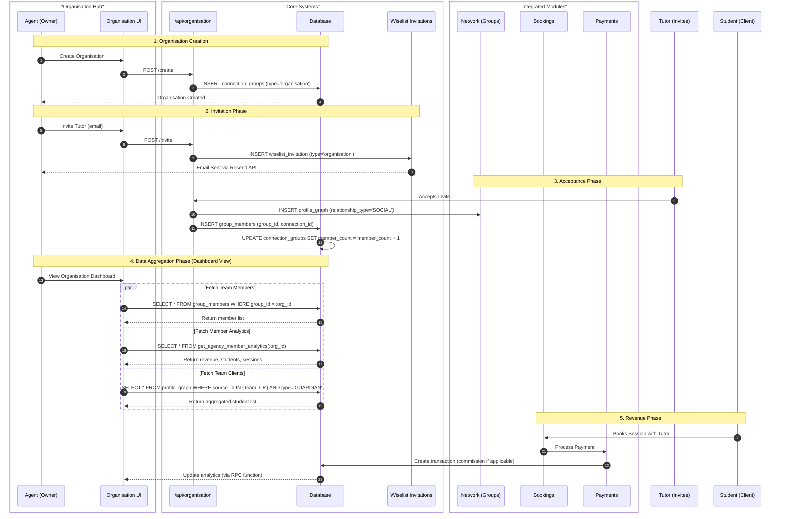

# Organisation Feature - Solution Design

**Version**: v7.0 (Premium Subscription - COMPLETE)
**Last Updated**: 2025-12-15
**Last Code Update**: 2025-12-15
**Status**: ✅ Active - All v7.0 features complete (Phase 1 & 2)
**Owner**: Senior Architect
**Architecture**: Virtual Entity Multi-Tenant System with Stripe Subscriptions & Performance Analytics
**Business Model**: £50/month Premium Subscription (14-day free trial)
**Dependencies**: v4.4 (Network Groups), v4.6 (Profile Graph), v5.0 (Wiselist Invitations), v3.2 (Hub Architecture), Stripe Subscriptions

## Change Log

| Date | Version | Description |
|------|---------|-------------|
| 2025-12-15 | v7.0 | **Phase 2 Complete**: Performance Analytics Tab fully implemented (10 files created/modified) |
| 2025-12-15 | v7.0 | **Phase 1 Complete**: Subscription infrastructure working (6 files created/modified) |
| 2025-12-13 | v7.0 | Added Premium Subscription model (£50/month, 14-day trial) + Performance Analytics tab design |
| 2025-12-12 | v6.1 | Documentation complete with comprehensive guides |
| 2025-12-03 | v6.1 | Migrated Team and Clients tabs to HubEmptyState |
| 2025-11-29 | v6.1 | Migrated to Hub Layout Architecture |
| 2025-11-19 | v6.0 | Initial organisation implementation |

---

## Executive Summary

This document details the architecture for the **Organisation Hub** (`/organisation`). The system enables multi-user business management for tutoring agencies, schools, and enterprises through a "Virtual Entity" model.

### Version 7.0: Premium Subscription Model (2025-12-13)

**Business Model Change**: Organisation feature transitions from free to paid (£50/month) with 14-day free trial.

**Rationale**:
- Agents already receive marketplace features for free (listings, bookings, commission)
- Organisation management + analytics is enterprise-grade value
- Single premium tier simplifies decision-making
- £50/month justified by Performance Analytics tab + unlimited team management

### Strategic Shift

We are moving beyond the "Solo Tutor" model to support Multi-User Businesses. By introducing the "Organisation" entity as a special-purpose connection group, we support three key personas with a single unified feature:

1. **Tutoring Agencies**: An Agent managing a roster of Tutors
2. **Schools**: A Headteacher managing Teachers and Students
3. **Enterprises**: L&D departments managing Trainers and Employees

### The Solution

We do NOT create a complex new "Organisation User Type." Instead, we **upgrade the existing Network Groups system** (v4.4) to support "Business Identities." An organisation is simply a special type of Group (`connection_groups.type = 'organisation'`) that owns branding, invites members, and aggregates data.

**Why this wins**:
- **Reuse**: Leverages `connection_groups` table (v4.4) and `wiselist_invitations` (v5.0)
- **Flexibility**: A user can own multiple organisations
- **Simplicity**: No separate authentication layer needed

---

## Premium Subscription Model (v7.0)

### Pricing Structure

**Single Premium Tier**: £50/month
- 14-day free trial (no credit card required)
- Cancel anytime
- No free tier (agents get marketplace for free already)

### What's Included in Premium

```
┌─────────────────────────────────────────────────┐
│         ORGANISATION PREMIUM                     │
│              £50/month                           │
│          14-day free trial                       │
├─────────────────────────────────────────────────┤
│ ✅ Unlimited team members                       │
│ ✅ Team management hub (3 tabs)                 │
│    • Team: Member list with analytics          │
│    • Clients: Aggregated students               │
│    • Info: Organisation settings                │
│ ✅ Performance Analytics (NEW - 4th tab)        │
│    • Revenue KPIs & trends (6 months)           │
│    • Team performance comparison                │
│    • Student retention metrics                  │
│    • Booking heatmaps                           │
│    • Profile views tracking                     │
│ ✅ Commission tracking                          │
│ ✅ Verification management (DBS, ID)            │
│ ✅ Internal notes per member                    │
│ ✅ CSV/Excel exports                            │
│ ✅ Unlimited data retention                     │
│ ✅ Priority support (24hr email)                │
└─────────────────────────────────────────────────┘
```

### Revenue Projection

**Year 1 (Conservative)**:
- 50 agents on platform
- 20% create organisations and start trial (10 trials)
- 50% convert to paid after trial (5 customers)
- **Revenue**: 5 × £50/month = £250/month = **£3,000 ARR**

**Year 2 (Growth)**:
- 150 agents on platform
- 25% create organisations (37 trials)
- 50% convert (18 customers)
- **Revenue**: 18 × £50/month = £900/month = **£10,800 ARR**

**Break-Even**:
- Development cost: £200/month platform-wide (AI dev)
- Organisation feature allocation: ~£50/month (25% of dev time)
- **Break-even**: 1 paying customer (1 × £50 = £50/month)
- **ROI Year 1**: 400% (£3,000 ARR vs £600 allocated dev cost)
- **ROI Year 2**: 1,700% (£10,800 ARR vs £600 allocated dev cost)

### User Journey

**Step 1: Agent Without Organisation (Current State)**
- Uses marketplace features for free (listings, bookings, commission)
- Sees upgrade prompt: "Manage your team with Organisation - Try 14 days free"

**Step 2: Trial Start**
```
Agent clicks "Create Organisation"
  ↓
Enters organisation details (name, logo, website, contact info)
  ↓
"Start 14-Day Free Trial" button (no credit card required)
  ↓
Full access to Organisation hub (all 4 tabs unlocked)
  ↓
Can invite unlimited team members
  ↓
Can explore Performance Analytics tab
```

**Step 3: Trial Expiration (Day 14)**
```
Email: "Your trial ends in 3 days - Add payment method to continue"
  ↓
Option A: Add credit card → Convert to £50/month subscription (auto-renew)
  OR
Option B: Don't add card → Lose access to Organisation hub after trial ends
```

**Step 4: Paying Customer**
- Full access to all features
- £50/month billed automatically via Stripe
- Can cancel anytime (access continues until end of billing period)

### Access Control

**Before Subscription (Free Marketplace Features)**:
- Agent profile visible on marketplace
- Can list tutors/teachers
- Receives bookings
- Earns commission on bookings
- Uses referral system
- **Cannot** create or access Organisation hub

**During Trial (Day 1-14)**:
- Full access to Organisation hub
- All 4 tabs unlocked (Team, Clients, Info, Performance)
- Unlimited team member invites
- All analytics visible
- Subscription status: `trialing`

**After Trial Without Payment**:
- Organisation hub access blocked
- Redirect to subscription required page
- Data preserved (can reactivate by subscribing)
- Subscription status: `trial_ended` → requires payment

**Active Subscription**:
- Full access to all features
- Subscription status: `active`
- Auto-renewal on billing date

**Past Due**:
- Grace period: 3 days
- Email reminders to update payment method
- After 3 days: Access blocked until payment resolved
- Subscription status: `past_due`

**Canceled**:
- Access continues until end of current billing period
- No auto-renewal
- Subscription status: `canceled`

---

## Architecture & Data Model

### 1. The "Virtual Entity" Model

An Organisation is a data container owned by a User (`profile_id`). It is not a separate login entity.

**Entity Relationship Diagram (ASCII)**:

```
┌─────────────────────┐
│  User: Agent        │
│  (profile_id)       │
│  roles: ['agent']   │
└──────────┬──────────┘
           │ owns (profile_id)
           ▼
┌─────────────────────────────┐
│  connection_groups          │
│  type='organisation'        │
│  ├─ id (UUID)               │
│  ├─ profile_id (owner)      │
│  ├─ name                    │
│  ├─ slug                    │
│  ├─ avatar_url              │
│  ├─ description             │
│  ├─ website                 │
│  ├─ member_count            │
│  └─ settings (JSONB)        │
│     └─ default_commission   │
└──────────┬──────────────────┘
           │ contains (1:N)
           ▼
┌─────────────────────────────┐
│  group_members              │
│  ├─ group_id (FK)           │
│  ├─ connection_id (FK)      │
│  ├─ added_at                │
│  ├─ commission_rate         │  ← Individual override
│  ├─ internal_notes          │  ← Private to owner
│  └─ is_verified             │  ← DBS/ID status
└──────────┬──────────────────┘
           │ references
           ▼
┌─────────────────────────────┐
│  profile_graph              │
│  relationship_type='SOCIAL' │
│  Agent ←→ Tutor             │
│  ├─ id (UUID)               │
│  ├─ source_profile_id       │  ← Agent
│  ├─ target_profile_id       │  ← Tutor
│  └─ created_at              │
└─────────────────────────────┘
           │
           │ Tutor also has
           ▼
┌─────────────────────────────┐
│  profile_graph              │
│  relationship_type=         │
│  'GUARDIAN'                 │
│  Tutor ←→ Student           │
│  ├─ source_profile_id       │  ← Tutor (member)
│  └─ target_profile_id       │  ← Student (client)
└─────────────────────────────┘
```

### 2. Profile Graph Integration

We leverage the **v4.6 Profile Graph** to map the relationships:

- **Agent-Tutor**: Stored in `profile_graph` (`relationship_type='SOCIAL'`)
- **Tutor-Student**: Stored in `profile_graph` (`relationship_type='GUARDIAN'`)
- **Agent-Student**: **Derived Relationship** - The Agent "sees" a student if *any* of its Tutors has a link to that student in the `profile_graph`

This creates a two-hop relationship graph:
```
Agent → (SOCIAL) → Tutor → (GUARDIAN) → Student
```

The Clients tab aggregates all students by:
1. Get all member IDs from `group_members`
2. Query `profile_graph` for GUARDIAN relationships where `source_profile_id IN (member_ids)`
3. Return unique students

---

## Database Schema Design

### 1. Migration: `091_upgrade_network_groups.sql`

```sql
-- Upgrade connection_groups to support business identities
ALTER TABLE public.connection_groups
ADD COLUMN IF NOT EXISTS type TEXT CHECK (type IN ('personal', 'organisation')) DEFAULT 'personal',
ADD COLUMN IF NOT EXISTS slug TEXT UNIQUE,
ADD COLUMN IF NOT EXISTS avatar_url TEXT,
ADD COLUMN IF NOT EXISTS description TEXT,
ADD COLUMN IF NOT EXISTS website TEXT,
ADD COLUMN IF NOT EXISTS contact_name TEXT,
ADD COLUMN IF NOT EXISTS contact_email TEXT,
ADD COLUMN IF NOT EXISTS contact_phone TEXT,
ADD COLUMN IF NOT EXISTS address_line1 TEXT,
ADD COLUMN IF NOT EXISTS address_town TEXT,
ADD COLUMN IF NOT EXISTS address_city TEXT,
ADD COLUMN IF NOT EXISTS address_postcode TEXT,
ADD COLUMN IF NOT EXISTS address_country TEXT,
ADD COLUMN IF NOT EXISTS settings JSONB DEFAULT '{}';

-- Indexes for faster lookups
CREATE INDEX IF NOT EXISTS idx_connection_groups_type ON public.connection_groups(type);
CREATE INDEX IF NOT EXISTS idx_connection_groups_slug ON public.connection_groups(slug);
CREATE INDEX IF NOT EXISTS idx_connection_groups_profile ON public.connection_groups(profile_id);

-- RLS: Allow public read access for Organisations (for public profile pages)
CREATE POLICY "Public can view organisations"
  ON public.connection_groups FOR SELECT
  USING (type = 'organisation');

-- RLS: Only owner can update
CREATE POLICY "Owner can manage organisation"
  ON public.connection_groups FOR UPDATE
  USING (profile_id = auth.uid());
```

### 2. Group Members Enhancement (v6.3)

```sql
-- Add agency management fields to group_members
ALTER TABLE public.group_members
ADD COLUMN IF NOT EXISTS commission_rate NUMERIC(5,2) CHECK (commission_rate >= 0 AND commission_rate <= 100),
ADD COLUMN IF NOT EXISTS internal_notes TEXT,
ADD COLUMN IF NOT EXISTS is_verified BOOLEAN DEFAULT FALSE;

CREATE INDEX IF NOT EXISTS idx_group_members_group ON public.group_members(group_id);
CREATE INDEX IF NOT EXISTS idx_group_members_connection ON public.group_members(connection_id);
```

### 3. Profiles Enhancement (Verification Documents)

```sql
-- Add verification document fields
ALTER TABLE public.profiles
ADD COLUMN IF NOT EXISTS dbs_certificate_url TEXT,
ADD COLUMN IF NOT EXISTS identity_verification_document_url TEXT;
```

### 4. Analytics Function (v6.4)

```sql
CREATE OR REPLACE FUNCTION get_agency_member_analytics(org_id UUID)
RETURNS TABLE (
  member_id UUID,
  total_revenue NUMERIC,
  last_session_at TIMESTAMP,
  active_students INT
) AS $$
BEGIN
  RETURN QUERY
  WITH member_list AS (
    -- Get all member profile IDs
    SELECT
      CASE
        WHEN pg.source_profile_id = (SELECT profile_id FROM connection_groups WHERE id = org_id)
        THEN pg.target_profile_id
        ELSE pg.source_profile_id
      END AS tutor_id
    FROM group_members gm
    JOIN profile_graph pg ON pg.id = gm.connection_id
    WHERE gm.group_id = org_id
  )
  SELECT
    ml.tutor_id AS member_id,
    COALESCE(SUM(t.amount), 0) AS total_revenue,
    MAX(b.session_end_time) AS last_session_at,
    COUNT(DISTINCT b.client_id) FILTER (WHERE b.status IN ('confirmed', 'completed')) AS active_students
  FROM member_list ml
  LEFT JOIN bookings b ON b.tutor_id = ml.tutor_id
  LEFT JOIN transactions t ON t.booking_id = b.id AND t.type = 'tutor_payout'
  GROUP BY ml.tutor_id;
END;
$$ LANGUAGE plpgsql SECURITY DEFINER;
```

### 5. Subscription Schema (v7.0)

```sql
-- Migration: 102_add_organisation_subscriptions.sql
-- Purpose: Track Stripe subscriptions for organisations (Premium tier)

CREATE TABLE IF NOT EXISTS public.organisation_subscriptions (
  -- Primary key is organisation_id (one subscription per organisation)
  organisation_id UUID PRIMARY KEY REFERENCES public.connection_groups(id) ON DELETE CASCADE,

  -- Stripe integration
  stripe_subscription_id TEXT UNIQUE,
  stripe_customer_id TEXT,

  -- Subscription status
  status TEXT NOT NULL CHECK (status IN ('trialing', 'active', 'past_due', 'canceled', 'incomplete', 'incomplete_expired', 'unpaid')) DEFAULT 'trialing',

  -- Trial tracking
  trial_start TIMESTAMPTZ,
  trial_end TIMESTAMPTZ,

  -- Billing cycle
  current_period_start TIMESTAMPTZ NOT NULL,
  current_period_end TIMESTAMPTZ NOT NULL,

  -- Cancellation
  cancel_at_period_end BOOLEAN DEFAULT FALSE,
  canceled_at TIMESTAMPTZ,

  -- Metadata
  created_at TIMESTAMPTZ NOT NULL DEFAULT NOW(),
  updated_at TIMESTAMPTZ NOT NULL DEFAULT NOW()
);

-- Indexes
CREATE INDEX idx_organisation_subscriptions_stripe_id ON public.organisation_subscriptions(stripe_subscription_id);
CREATE INDEX idx_organisation_subscriptions_status ON public.organisation_subscriptions(status);
CREATE INDEX idx_organisation_subscriptions_trial_end ON public.organisation_subscriptions(trial_end);

-- RLS Policies
ALTER TABLE public.organisation_subscriptions ENABLE ROW LEVEL SECURITY;

-- Only organisation owner can view their subscription
CREATE POLICY "Owner can view organisation subscription"
  ON public.organisation_subscriptions FOR SELECT
  USING (
    organisation_id IN (
      SELECT id FROM public.connection_groups WHERE profile_id = auth.uid()
    )
  );

-- Trigger to update updated_at
CREATE TRIGGER update_organisation_subscriptions_updated_at
  BEFORE UPDATE ON public.organisation_subscriptions
  FOR EACH ROW
  EXECUTE FUNCTION public.update_updated_at_column();

COMMENT ON TABLE public.organisation_subscriptions IS 'v7.0: Stripe subscriptions for Organisation Premium tier (£50/month)';
```

### 6. Stripe Webhook Integration (v7.0)

**File**: `apps/web/src/app/api/webhooks/stripe/route.ts`

The existing Stripe webhook handler (used for booking payments and payouts) has been extended with 5 subscription event handlers to keep the database in sync with Stripe subscription lifecycle events.

#### Subscription Event Handlers

**1. `customer.subscription.created`** - Trial Signup
```typescript
case 'customer.subscription.created': {
  const subscription = event.data.object as Stripe.Subscription;
  const organisationId = subscription.metadata?.organisation_id;

  // Create organisation_subscriptions record
  await supabase
    .from('organisation_subscriptions')
    .insert({
      organisation_id: organisationId,
      stripe_subscription_id: subscription.id,
      stripe_customer_id: subscription.customer as string,
      status: subscription.status, // 'trialing'
      trial_start: new Date(subscription.trial_start * 1000).toISOString(),
      trial_end: new Date(subscription.trial_end * 1000).toISOString(),
      current_period_start: new Date(subscription.current_period_start * 1000).toISOString(),
      current_period_end: new Date(subscription.current_period_end * 1000).toISOString(),
      cancel_at_period_end: subscription.cancel_at_period_end,
    });
}
```
**Trigger**: User completes Stripe Checkout for trial
**Action**: Creates subscription record with status `trialing`
**Result**: User gains immediate access to Organisation hub

**2. `customer.subscription.updated`** - Status Changes
```typescript
case 'customer.subscription.updated': {
  const subscription = event.data.object as Stripe.Subscription;

  // Update subscription status in database
  await supabase
    .from('organisation_subscriptions')
    .update({
      status: subscription.status, // 'active', 'past_due', 'canceled', etc.
      trial_start: subscription.trial_start ? new Date(subscription.trial_start * 1000).toISOString() : null,
      trial_end: subscription.trial_end ? new Date(subscription.trial_end * 1000).toISOString() : null,
      current_period_start: new Date(subscription.current_period_start * 1000).toISOString(),
      current_period_end: new Date(subscription.current_period_end * 1000).toISOString(),
      cancel_at_period_end: subscription.cancel_at_period_end,
      canceled_at: subscription.canceled_at ? new Date(subscription.canceled_at * 1000).toISOString() : null,
    })
    .eq('stripe_subscription_id', subscription.id);
}
```
**Triggers**:
- Trial ends → `trialing` → `active` (if payment method added)
- User cancels → `cancel_at_period_end: true`
- Payment method updated
- Billing period changes

**Action**: Syncs all subscription fields from Stripe to database
**Result**: Database always reflects current Stripe state

**3. `customer.subscription.deleted`** - Subscription Canceled
```typescript
case 'customer.subscription.deleted': {
  const subscription = event.data.object as Stripe.Subscription;

  // Mark subscription as canceled
  await supabase
    .from('organisation_subscriptions')
    .update({
      status: 'canceled',
      canceled_at: new Date().toISOString(),
    })
    .eq('stripe_subscription_id', subscription.id);
}
```
**Trigger**: Subscription fully canceled (after billing period ends)
**Action**: Sets status to `canceled`, records cancellation timestamp
**Result**: User loses access to Organisation hub

**4. `invoice.payment_succeeded`** - Payment Confirmed
```typescript
case 'invoice.payment_succeeded': {
  const invoice = event.data.object as Stripe.Invoice;

  if (!invoice.subscription) {
    break; // Skip non-subscription invoices
  }

  // Ensure subscription status is 'active' (trial → paid conversion)
  await supabase
    .from('organisation_subscriptions')
    .update({
      status: 'active',
    })
    .eq('stripe_subscription_id', invoice.subscription as string)
    .in('status', ['trialing', 'past_due']); // Only update if trialing or recovering from past_due
}
```
**Triggers**:
- First payment after trial (trial → paid conversion)
- Monthly recurring payment successful
- User updates payment method and retry succeeds

**Action**: Confirms subscription is `active`
**Result**: User retains access, subscription renews for next billing cycle

**5. `invoice.payment_failed`** - Payment Failed
```typescript
case 'invoice.payment_failed': {
  const invoice = event.data.object as Stripe.Invoice;

  if (!invoice.subscription) {
    break; // Skip non-subscription invoices
  }

  // Update subscription status to 'past_due'
  await supabase
    .from('organisation_subscriptions')
    .update({
      status: 'past_due',
    })
    .eq('stripe_subscription_id', invoice.subscription as string);

  // TODO: Send email notification to organisation owner about failed payment
}
```
**Trigger**: Monthly payment fails (expired card, insufficient funds, etc.)
**Action**: Sets status to `past_due`
**Result**:
- User has 3-day grace period (Stripe default)
- After grace period: Subscription canceled, access blocked
- Email notification sent to update payment method

#### Webhook Configuration

**Endpoint**: `https://tutorwise.com/api/webhooks/stripe`
**Required Events** (configure in Stripe Dashboard):
- `customer.subscription.created`
- `customer.subscription.updated`
- `customer.subscription.deleted`
- `invoice.payment_succeeded`
- `invoice.payment_failed`

**Environment Variable**:
```bash
STRIPE_WEBHOOK_SECRET=whsec_xxxxx  # From Stripe Dashboard
```

**Idempotency**: All handlers are idempotent - safe to retry
**Error Handling**: Failed webhooks logged to `failed_webhooks` table (DLQ)
**Logging**: All events logged with `[WEBHOOK:SUBSCRIPTION]` prefix

### 7. Environment Variables & Setup (v7.0)

**Required Environment Variables** (add to `.env.local`):

```bash
# Stripe Configuration
STRIPE_SECRET_KEY=sk_test_xxxxx                    # Already exists (for bookings)
STRIPE_WEBHOOK_SECRET=whsec_xxxxx                  # Already exists (for bookings)
STRIPE_PREMIUM_PRICE_ID=price_xxxxx                # NEW - Organisation Premium Price ID

# Optional: Stripe Publishable Key (already exists)
NEXT_PUBLIC_STRIPE_PUBLISHABLE_KEY=pk_test_xxxxx
```

**Setup Instructions**:

**Step 1: Create Stripe Product** (if not already created)

1. Go to [Stripe Dashboard](https://dashboard.stripe.com/products)
2. Click **"+ Add product"**
3. Fill in product details:
   - **Name**: `Organisation Premium`
   - **Description**: `£50/month subscription for team management and analytics`
   - **Pricing model**: `Recurring`
   - **Price**: `50.00 GBP`
   - **Billing period**: `Monthly`
4. Click **"Save product"**
5. Copy the **Price ID** (starts with `price_`)
6. Add to `.env.local`:
   ```bash
   STRIPE_PREMIUM_PRICE_ID=price_xxxxx
   ```

**Step 2: Configure Webhook Events** (extend existing webhook)

The webhook endpoint already exists at `/api/webhooks/stripe` (used for booking payments).

1. Go to [Stripe Dashboard → Webhooks](https://dashboard.stripe.com/webhooks)
2. Find existing webhook endpoint (should already be configured)
3. Click **"Add events"** to add subscription events:
   - ✅ `customer.subscription.created`
   - ✅ `customer.subscription.updated`
   - ✅ `customer.subscription.deleted`
   - ✅ `invoice.payment_succeeded`
   - ✅ `invoice.payment_failed`
4. Click **"Add events"** to save

**Note**: The webhook handler at `/api/webhooks/stripe` already handles both booking payments (existing) and subscription events (new). No separate webhook endpoint needed.

**Step 3: Verify Environment Variables**

Run this check to ensure all variables are set:

```bash
# Check if variables are set
node -e "
const env = process.env;
const required = ['STRIPE_SECRET_KEY', 'STRIPE_WEBHOOK_SECRET', 'STRIPE_PREMIUM_PRICE_ID'];
const missing = required.filter(key => !env[key]);
if (missing.length > 0) {
  console.error('❌ Missing:', missing.join(', '));
  process.exit(1);
}
console.log('✅ All Stripe environment variables configured');
"
```

**Step 4: Test Subscription Flow** (in Stripe Test Mode)

1. Visit `/organisation` page (will show SubscriptionRequired component)
2. Click **"Start Free Trial"**
3. Use Stripe test card: `4242 4242 4242 4242`
4. Complete checkout
5. Verify webhook received: Check [Stripe Dashboard → Webhooks](https://dashboard.stripe.com/webhooks)
6. Verify database: Check `organisation_subscriptions` table has new record with `status='trialing'`

**Step 5: Production Deployment Checklist**

Before going live with subscription billing:

- [ ] Switch to Stripe Live Mode keys (not test keys)
- [ ] Create live product with `price_xxxxx` (live mode price ID)
- [ ] Update `.env.production` with live `STRIPE_PREMIUM_PRICE_ID`
- [ ] Configure live webhook endpoint with live `STRIPE_WEBHOOK_SECRET`
- [ ] Test trial signup with real card (then immediately cancel)
- [ ] Monitor first 24 hours of webhook logs for errors
- [ ] Set up alerts for failed subscription webhooks

### 8. Performance Analytics RPC Functions (v7.0)

```sql
-- Migration: 103_add_organisation_performance_analytics.sql
-- Purpose: Analytics functions for Performance tab (Premium feature)

-- Function 1: Get organisation-level KPIs
CREATE OR REPLACE FUNCTION get_organisation_kpis(org_id UUID, period TEXT DEFAULT 'month')
RETURNS TABLE (
  total_revenue NUMERIC,
  revenue_change_pct NUMERIC,
  active_students INT,
  students_change_pct NUMERIC,
  avg_session_rating NUMERIC,
  team_utilization_rate NUMERIC,
  client_acquisition_cost NUMERIC,
  client_lifetime_value NUMERIC
) AS $$
BEGIN
  RETURN QUERY
  WITH current_period AS (
    SELECT
      COALESCE(SUM(t.amount), 0) AS revenue,
      COUNT(DISTINCT b.client_id) AS students,
      AVG(pr.rating) AS avg_rating
    FROM group_members gm
    JOIN profile_graph pg ON pg.id = gm.connection_id
    JOIN bookings b ON b.tutor_id = CASE
      WHEN pg.source_profile_id = (SELECT profile_id FROM connection_groups WHERE id = org_id)
      THEN pg.target_profile_id ELSE pg.source_profile_id END
    LEFT JOIN transactions t ON t.booking_id = b.id AND t.type = 'tutor_payout'
    LEFT JOIN profile_reviews pr ON pr.reviewee_id = b.tutor_id
    WHERE gm.group_id = org_id
      AND b.status = 'Completed'
      AND b.session_start_time >= date_trunc(period, CURRENT_DATE)
  ),
  previous_period AS (
    SELECT
      COALESCE(SUM(t.amount), 0) AS revenue,
      COUNT(DISTINCT b.client_id) AS students
    FROM group_members gm
    JOIN profile_graph pg ON pg.id = gm.connection_id
    JOIN bookings b ON b.tutor_id = CASE
      WHEN pg.source_profile_id = (SELECT profile_id FROM connection_groups WHERE id = org_id)
      THEN pg.target_profile_id ELSE pg.source_profile_id END
    LEFT JOIN transactions t ON t.booking_id = b.id AND t.type = 'tutor_payout'
    WHERE gm.group_id = org_id
      AND b.status = 'Completed'
      AND b.session_start_time >= date_trunc(period, CURRENT_DATE - INTERVAL '1 month')
      AND b.session_start_time < date_trunc(period, CURRENT_DATE)
  )
  SELECT
    cp.revenue AS total_revenue,
    CASE WHEN pp.revenue > 0
      THEN ((cp.revenue - pp.revenue) / pp.revenue * 100)::NUMERIC
      ELSE 0 END AS revenue_change_pct,
    cp.students AS active_students,
    CASE WHEN pp.students > 0
      THEN ((cp.students::NUMERIC - pp.students::NUMERIC) / pp.students::NUMERIC * 100)
      ELSE 0 END AS students_change_pct,
    COALESCE(cp.avg_rating, 0) AS avg_session_rating,
    0.75 AS team_utilization_rate, -- TODO: Calculate from availability
    0 AS client_acquisition_cost,   -- TODO: Calculate from marketing data
    0 AS client_lifetime_value       -- TODO: Calculate from historical bookings
  FROM current_period cp, previous_period pp;
END;
$$ LANGUAGE plpgsql SECURITY DEFINER;

-- Function 2: Get revenue trend data
CREATE OR REPLACE FUNCTION get_organisation_revenue_trend(org_id UUID, weeks INT DEFAULT 6)
RETURNS TABLE (
  week_label TEXT,
  total_revenue NUMERIC
) AS $$
BEGIN
  RETURN QUERY
  SELECT
    TO_CHAR(date_trunc('week', b.session_start_time), 'Mon DD') AS week_label,
    COALESCE(SUM(t.amount), 0) AS total_revenue
  FROM group_members gm
  JOIN profile_graph pg ON pg.id = gm.connection_id
  JOIN bookings b ON b.tutor_id = CASE
    WHEN pg.source_profile_id = (SELECT profile_id FROM connection_groups WHERE id = org_id)
    THEN pg.target_profile_id ELSE pg.source_profile_id END
  LEFT JOIN transactions t ON t.booking_id = b.id AND t.type = 'tutor_payout'
  WHERE gm.group_id = org_id
    AND b.status = 'Completed'
    AND b.session_start_time >= CURRENT_DATE - (weeks || ' weeks')::INTERVAL
  GROUP BY date_trunc('week', b.session_start_time)
  ORDER BY date_trunc('week', b.session_start_time);
END;
$$ LANGUAGE plpgsql SECURITY DEFINER;

-- Function 3: Get team performance comparison
CREATE OR REPLACE FUNCTION get_team_performance(org_id UUID)
RETURNS TABLE (
  member_id UUID,
  member_name TEXT,
  total_revenue NUMERIC,
  sessions_count INT,
  avg_rating NUMERIC
) AS $$
BEGIN
  RETURN QUERY
  SELECT
    p.id AS member_id,
    p.full_name AS member_name,
    COALESCE(SUM(t.amount), 0) AS total_revenue,
    COUNT(b.id)::INT AS sessions_count,
    COALESCE(AVG(pr.rating), 0) AS avg_rating
  FROM group_members gm
  JOIN profile_graph pg ON pg.id = gm.connection_id
  JOIN profiles p ON p.id = CASE
    WHEN pg.source_profile_id = (SELECT profile_id FROM connection_groups WHERE id = org_id)
    THEN pg.target_profile_id ELSE pg.source_profile_id END
  LEFT JOIN bookings b ON b.tutor_id = p.id AND b.status = 'Completed'
  LEFT JOIN transactions t ON t.booking_id = b.id AND t.type = 'tutor_payout'
  LEFT JOIN profile_reviews pr ON pr.reviewee_id = p.id
  WHERE gm.group_id = org_id
  GROUP BY p.id, p.full_name
  ORDER BY total_revenue DESC;
END;
$$ LANGUAGE plpgsql SECURITY DEFINER;

COMMENT ON FUNCTION get_organisation_kpis IS 'v7.0: Performance Analytics - Organisation-level KPIs for Premium tier';
COMMENT ON FUNCTION get_organisation_revenue_trend IS 'v7.0: Performance Analytics - Revenue trend chart data';
COMMENT ON FUNCTION get_team_performance IS 'v7.0: Performance Analytics - Team member comparison data';
```

---

## Frontend & UI Design

### 1. Page Layout (`/organisation`)

**Route**: `apps/web/src/app/(authenticated)/organisation/page.tsx` (730 lines)

**Layout**: Standard Hub Architecture (v3.2) - 2-Column Layout with Context Sidebar

**UI Diagram (ASCII)**:

```
+-----------------------------------------------------------------------+
|  [HubHeader: "My Organisation"]                                       |
|  [Filters: Search, Sort]         [Actions: Invite Member] [⋮ Menu]    |
+-----------------------------------------------------------------------+
|  [HubTabs: Team (12) | Clients (45) | Organisation Info ]             |
+-----------------------------------------------------------------------+
|  Main Column (70%)                    |  Context Sidebar (30%)        |
|                                       |                               |
|  +---------------------------------+  | +---------------------------+ |
|  | Team Tab                        |  | | OrganisationStatsWidget   | |
|  |                                 |  | |                           | |
|  | [Search: "Search members..."]   |  | |  Team Size             12 | |
|  | [Sort: Newest First ▼]          |  | |  Total Clients         45 | |
|  |                                 |  | |  Monthly Rev    £3,450.00 | |
|  | +-----------------------------+ |  | +---------------------------+ |
|  | | MemberCard                  | |  |                               |
|  | | [Avatar] Michael Quan       | |  | +---------------------------+ |
|  | | Maths Tutor                 | |  | | OrganisationHelpWidget    | |
|  | | 5 Active Students           | |  | +---------------------------+ |
|  | | Revenue: £1,234             | |  |                               |
|  | | [ Message ] [ Manage ]      | |  | +---------------------------+ |
|  | +-----------------------------+ |  | | OrganisationTipWidget     | |
|  |                                 |  | +---------------------------+ |
|  | +-----------------------------+ |  |                               |
|  | | MemberCard                  | |  | +---------------------------+ |
|  | | [Avatar] Sarah Jones        | |  | | OrganisationVideoWidget   | |
|  | | English Tutor               | |  | +---------------------------+ |
|  | | 8 Active Students           | |  |                               |
|  | | Revenue: £2,100             | |  |                               |
|  | | [ Message ] [ Manage ]      | |  |                               |
|  | +-----------------------------+ |  |                               |
|  |                                 |  |                               |
|  | [Pagination: 1 2 3 > ]          |  |                               |
+--+---------------------------------+--+-------------------------------+
```

### 2. Tab Strategy

**Team Tab** (Default):
- **Content**: List of Tutors from `group_members` → `profile_graph` → `profiles`
- **Component**: `MemberCard` (standard hub row card variant)
- **Actions**:
  - Message (navigate to `/messages?userId={member.id}`)
  - Manage (open `ManageMemberModal` - commission rate, notes, verification)
  - Remove (with confirmation dialog)
- **Pagination**: 4 items per page (controlled via `ITEMS_PER_PAGE` constant)
- **Empty State**: `HubEmptyState` - "No team members yet"

**Clients Tab** (Lazy Loaded):
- **Content**: Aggregated students linked to the Team's Tutors
- **Logic**: Query `profile_graph` for all `target_profile_id` where `source_profile_id IN (My_Tutor_IDs)` AND `relationship_type = 'GUARDIAN'`
- **Component**: `OrganisationStudentCard`
- **Value**: Gives the Agent visibility into the "Revenue Source"
- **Performance**: Only queries when `activeTab === 'clients'` (React Query `enabled` flag)
- **Empty State**: `HubEmptyState` - "No clients yet"

**Info Tab** (Settings):
- **Content**: Edit Form (Name, Slug, Logo, Description, Contact Info, Address)
- **Component**: `OrganisationInfoTab` (reuses `PersonalInfoForm` patterns)
- **Fields**:
  - Basic: name, description, website, avatar_url
  - Contact: contact_name, contact_email, contact_phone
  - Address: address_line1, address_town, address_city, address_postcode, address_country
  - Settings: default_commission_rate (JSONB)

### 3. Component Architecture

**MemberCard** (`apps/web/src/app/components/feature/organisation/MemberCard.tsx`):
```typescript
interface MemberCardProps {
  member: OrganisationMember;
  onMessage: (memberId: string) => void;
  onRemove: (memberId: string, memberName: string) => void;
  onManage: (member: OrganisationMember) => void;
}

// Displays:
// - Avatar, name, bio
// - Role (default: "Tutor")
// - Active students count
// - Total revenue earned
// - Last session date
// - Verification status (DBS/ID badges)
// - Action buttons: Message, Manage
```

**ManageMemberModal** (`ManageMemberModal.tsx`):
```typescript
interface ManageMemberModalProps {
  isOpen: boolean;
  onClose: () => void;
  member: OrganisationMember;
  organisationId: string;
  defaultCommissionRate: number | null;
}

// Editable fields:
// - commission_rate (override default)
// - internal_notes (private to agent)
// - is_verified (checkbox)
```

**OrganisationStatsWidget** (`OrganisationStatsWidget.tsx`):
```typescript
interface StatsWidgetProps {
  teamSize: number;
  totalClients: number;
  monthlyRevenue: number;
}

// Displays:
// - Team Size: 12 members
// - Total Clients: 45 students
// - Monthly Revenue: £3,450.00
```

### 4. Subscription Components (v7.0)

**SubscriptionRequired** (`apps/web/src/app/components/feature/organisation/SubscriptionRequired.tsx`):

```typescript
interface SubscriptionRequiredProps {
  organisation: {
    id: string;
    name: string;
  };
  subscription: OrganisationSubscription | null;
  onStartTrial: () => void;
  isLoading?: boolean;
}

// Purpose: Block access for non-Premium users
// Displays different content based on subscription status:
// - No subscription: Trial signup screen with 6 Premium features
// - Canceled: Reactivate CTA
// - Past due: Update payment method CTA
// - Unpaid: Contact support CTA

// Features List Shown:
// ✅ 14-day free trial (no credit card required)
// ✅ Unlimited team members
// ✅ Client aggregation and analytics
// ✅ Commission management
// ✅ Performance analytics dashboard
// ✅ Member verification tracking

// Pricing Display:
// £50/month with "Start Free Trial" CTA button
```

**Access Guard Implementation** (in `/organisation/page.tsx`):

```typescript
// 1. Fetch subscription status
const {
  data: subscription,
  isLoading: subscriptionLoading,
} = useQuery({
  queryKey: ['organisation-subscription', organisation?.id],
  queryFn: () => getOrganisationSubscription(organisation!.id),
  enabled: !!organisation,
  staleTime: 2 * 60 * 1000,
});

// 2. Block access if no active subscription
if (organisation && !subscriptionLoading && !isPremium(subscription)) {
  return (
    <HubPageLayout>
      <SubscriptionRequired
        organisation={organisation}
        subscription={subscription}
        onStartTrial={handleStartTrial}
      />
    </HubPageLayout>
  );
}

// 3. handleStartTrial() redirects to Stripe Checkout
const handleStartTrial = async () => {
  const response = await fetch('/api/stripe/checkout/trial', {
    method: 'POST',
    headers: { 'Content-Type': 'application/json' },
    body: JSON.stringify({ organisationId: organisation.id }),
  });

  const { url } = await response.json();
  window.location.href = url; // Redirect to Stripe Checkout
};
```

**isPremium() Helper Function** (`lib/stripe/subscription.ts`):

```typescript
export function isPremium(subscription: OrganisationSubscription | null): boolean {
  if (!subscription) return false;
  return subscription.status === 'trialing' || subscription.status === 'active';
}

// Only 'trialing' and 'active' statuses grant access
// All other statuses ('past_due', 'canceled', 'unpaid', etc.) are blocked
```

### 5. API Routes (v7.0)

**Trial Checkout** (`apps/web/src/app/api/stripe/checkout/trial/route.ts`):

```typescript
POST /api/stripe/checkout/trial

Request Body:
{
  organisationId: string  // UUID of organisation
}

Response:
{
  url: string,          // Stripe Checkout URL
  sessionId: string     // Checkout Session ID
}

// Security Checks:
// 1. User must be authenticated
// 2. User must own the organisation (profile_id matches)
// 3. Organisation must not already have active subscription
// 4. Creates Stripe Checkout Session with:
//    - 14-day trial
//    - £50/month recurring
//    - organisation_id in metadata
//    - trial_settings.end_behavior.missing_payment_method: 'cancel'
```

**Subscription Service Functions** (`lib/stripe/subscription.ts`):

```typescript
// Get subscription from database
export async function getOrganisationSubscription(
  organisationId: string
): Promise<OrganisationSubscription | null>

// Create trial checkout session
export async function createTrialCheckoutSession(
  organisationId: string
): Promise<Stripe.Checkout.Session>

// Create billing portal session (manage subscription)
export async function createBillingPortalSession(
  organisationId: string,
  returnUrl?: string
): Promise<Stripe.BillingPortal.Session>

// Cancel subscription at period end
export async function cancelSubscription(
  organisationId: string
): Promise<void>

// Reactivate canceled subscription
export async function reactivateSubscription(
  organisationId: string
): Promise<void>

// Sync subscription status from Stripe
export async function syncSubscriptionStatus(
  organisationId: string
): Promise<void>

// Check if organisation has active subscription (helper for RLS)
export async function organisationHasActiveSubscription(
  organisationId: string
): Promise<boolean>
```

---

## System Integration & Process Flow

### 1. Integrated Sequence Diagram

This diagram illustrates how the **Organisation Hub** triggers and consumes data from all other platform systems.



### 2. Data Fetching Strategy (Performance)

**Problem**: Calculating "Total Clients" for an agency with 50 tutors is expensive (50 x N students = potentially thousands of rows).

**Solution**: Lazy Loading + RPC Functions
- Overview stats: Fetched via dedicated RPC `get_agency_member_analytics(group_id)`
- Clients tab data: Only fetched when user clicks the "Clients" tab (React Query `enabled` flag)
- Member list: Cached for 2 minutes (React Query `staleTime`)
- Stats: Cached for 5 minutes

**Implementation**:
```typescript
// Lazy load clients
const {
  data: clients = [],
  isLoading: clientsLoading,
} = useQuery({
  queryKey: ['organisation-clients', organisation?.id],
  queryFn: () => getOrganisationClients(organisation!.id),
  enabled: !!organisation && activeTab === 'clients', // ← Only when tab active
  staleTime: 5 * 60 * 1000, // 5 minutes
});
```

---

## Core Workflows

### Workflow 1: Create Organisation

**Prerequisite**: User must have `agent` role in `profiles.roles` array.

**Frontend Flow** (`/organisation` page):
```typescript
// 1. Check if user has agent role
const { data: profile } = await supabase
  .from('profiles')
  .select('roles')
  .eq('id', user.id)
  .single();

if (!profile.roles || !profile.roles.includes('agent')) {
  throw new Error('Only users with the agent role can create organisations');
}

// 2. Show create modal
setShowCreateModal(true);

// 3. Submit form
const handleCreateOrganisation = async (e) => {
  e.preventDefault();
  const formData = new FormData(e.currentTarget);

  await createOrgMutation.mutate({
    name: formData.get('name'),
    description: formData.get('description'),
    website: formData.get('website')
  });
};
```

**Backend Operation** (`/lib/api/organisation.ts:createOrganisation`):
```typescript
export async function createOrganisation(data: {
  name: string;
  description?: string;
  website?: string;
  avatar_url?: string;
}): Promise<Organisation> {
  const supabase = createClient();
  const { data: { user } } = await supabase.auth.getUser();

  // 1. Verify agent role
  const { data: profile } = await supabase
    .from('profiles')
    .select('roles')
    .eq('id', user.id)
    .single();

  if (!profile.roles || !profile.roles.includes('agent')) {
    throw new Error('Only users with the agent role can create organisations');
  }

  // 2. Create organisation
  const { data: newOrg, error } = await supabase
    .from('connection_groups')
    .insert({
      profile_id: user.id,
      name: data.name,
      type: 'organisation',
      description: data.description || null,
      website: data.website || null,
      avatar_url: data.avatar_url || null,
      // slug will be auto-generated by database trigger
    })
    .select()
    .single();

  if (error) throw error;
  return newOrg as Organisation;
}
```

### Workflow 2: Invite Team Member

**Integration Point**: Reuses wiselist invitation system (v5.0)

**Frontend Flow**:
```typescript
// 1. Open invite modal
setShowInviteModal(true);

// 2. Submit email
const handleInvite = async (email: string) => {
  await fetch('/api/organisation/invite', {
    method: 'POST',
    body: JSON.stringify({
      organisationId: organisation.id,
      email,
      role: 'tutor'
    })
  });
};
```

**Backend Flow**:
1. Create `wiselist_invitation` record (`type='organisation'`)
2. Send email notification via Resend API
3. On acceptance:
   - Create `profile_graph` relationship (`SOCIAL` type between agent and tutor)
   - Insert into `group_members` (links group → connection)
   - Increment `connection_groups.member_count`

### Workflow 3: View Team Members

**Query Chain** (`getOrganisationMembers` function):

```typescript
// Step 1: Fetch group_members records
const { data: groupMembersData } = await supabase
  .from('group_members')
  .select('added_at, connection_id, commission_rate, internal_notes, is_verified')
  .eq('group_id', organisationId);

// Step 2: Fetch profile_graph connections
const connectionIds = groupMembersData.map(gm => gm.connection_id);
const { data: connectionsData } = await supabase
  .from('profile_graph')
  .select('id, source_profile_id, target_profile_id')
  .in('id', connectionIds);

// Step 3: Extract member profile IDs (exclude current user)
const profileIds = new Set<string>();
connectionsData.forEach(conn => {
  if (conn.source_profile_id !== user.id) profileIds.add(conn.source_profile_id);
  if (conn.target_profile_id !== user.id) profileIds.add(conn.target_profile_id);
});

// Step 4: Fetch all profiles in one query
const { data: profilesData } = await supabase
  .from('profiles')
  .select('id, full_name, email, avatar_url, bio, city, dbs_certificate_url, identity_verification_document_url')
  .in('id', Array.from(profileIds));

// Step 5: Fetch analytics for all members
const { data: analyticsData } = await supabase
  .rpc('get_agency_member_analytics', { org_id: organisationId });

// Step 6: Join and return OrganisationMember[]
const members: OrganisationMember[] = groupMembersData.map(gm => {
  const connection = connectionsMap.get(gm.connection_id);
  const memberProfile = profilesMap.get(memberProfileId);
  const analytics = analyticsMap.get(memberProfile.id);

  return {
    id: memberProfile.id,
    connection_id: connection.id,
    full_name: memberProfile.full_name,
    email: memberProfile.email,
    avatar_url: memberProfile.avatar_url,
    bio: memberProfile.bio,
    role: 'Tutor',
    location: memberProfile.city,
    added_at: gm.added_at,
    commission_rate: gm.commission_rate,
    internal_notes: gm.internal_notes,
    is_verified: gm.is_verified,
    total_revenue: analytics.total_revenue,
    last_session_at: analytics.last_session_at,
    active_students_count: analytics.active_students,
    dbs_certificate_url: memberProfile.dbs_certificate_url,
    identity_verification_document_url: memberProfile.identity_verification_document_url
  };
});

return members;
```

**Why This Complexity?**:
- `group_members` links groups to connections (not directly to profiles)
- `profile_graph` stores the actual relationships
- Need to determine which end of the connection is the member (not the owner)
- Must aggregate analytics from bookings and transactions

### Workflow 4: View Aggregated Clients

**Query** (`getOrganisationClients` function):

```typescript
// Step 1: Get all member IDs
const members = await getOrganisationMembers(organisationId);
const memberIds = members.map(m => m.id);

if (memberIds.length === 0) return [];

// Step 2: Query profile_graph for GUARDIAN relationships
const { data, error } = await supabase
  .from('profile_graph')
  .select(`
    id,
    source_profile_id,
    target_profile_id,
    created_at,
    source:source_profile_id(id, full_name, email, avatar_url),
    target:target_profile_id(id, full_name, email, avatar_url)
  `)
  .eq('relationship_type', 'GUARDIAN')
  .in('source_profile_id', memberIds);

// Step 3: Map to client format
const clients = data.map(link => {
  const tutor = link.source; // Source is the tutor (member)
  const student = link.target; // Target is the student (client)

  return {
    id: student.id,
    full_name: student.full_name,
    email: student.email,
    avatar_url: student.avatar_url,
    tutor_name: tutor.full_name,
    tutor_id: tutor.id,
    since: link.created_at
  };
});

return clients;
```

**Two-Hop Relationship**:
```
Agent → [SOCIAL via group_members] → Tutor → [GUARDIAN via profile_graph] → Student
```

The agent doesn't have a direct relationship with students - it's derived through the team members.

### Workflow 5: Update Member Settings

**Use Cases**:
- Set individual commission rate (override default)
- Add private notes about member
- Mark member as verified (DBS + ID checks complete)

**Implementation** (`updateMemberSettings` function):

```typescript
export async function updateMemberSettings(
  organisationId: string,
  connectionId: string,
  updates: {
    commission_rate?: number | null;
    internal_notes?: string | null;
    is_verified?: boolean;
  }
): Promise<OrganisationMember> {
  const supabase = createClient();
  const { data: { user } } = await supabase.auth.getUser();

  // 1. Verify ownership (only owner can manage member settings)
  const { data: org } = await supabase
    .from('connection_groups')
    .select('profile_id')
    .eq('id', organisationId)
    .single();

  if (org.profile_id !== user.id) {
    throw new Error('Unauthorized: Only the agency owner can manage member settings.');
  }

  // 2. Validate commission_rate if provided
  if (updates.commission_rate !== undefined && updates.commission_rate !== null) {
    if (updates.commission_rate < 0 || updates.commission_rate > 100) {
      throw new Error('Commission rate must be between 0 and 100');
    }
  }

  // 3. Perform update
  const { data, error } = await supabase
    .from('group_members')
    .update(updates)
    .eq('group_id', organisationId)
    .eq('connection_id', connectionId)
    .select()
    .single();

  if (error) throw error;

  return data as OrganisationMember;
}
```

---

## TypeScript Interfaces

### Organisation

```typescript
export interface Organisation {
  id: string;
  profile_id: string;                      // Owner (agent)
  name: string;
  slug: string | null;                     // URL-safe identifier
  type: 'personal' | 'organisation';
  avatar_url: string | null;               // Logo
  description: string | null;
  website: string | null;
  color: string;
  icon: string;
  is_favorite: boolean;
  member_count: number;                    // Denormalized
  settings: {
    default_commission_rate?: number;      // Default commission %
  };
  // Contact fields
  contact_name?: string | null;
  contact_email?: string | null;
  contact_phone?: string | null;
  // Address fields
  address_line1?: string | null;
  address_town?: string | null;
  address_city?: string | null;
  address_postcode?: string | null;
  address_country?: string | null;
  created_at: string;
  updated_at: string;
}
```

### OrganisationMember

```typescript
export interface OrganisationMember {
  id: string;                              // Profile ID
  connection_id: string;                   // profile_graph relationship ID
  full_name: string | null;
  email: string;
  avatar_url: string | null;
  bio: string | null;
  role: string | null;                     // e.g., "Tutor"
  location: string | null;                 // City
  added_at: string;                        // Timestamp when added to org
  // Agency management fields (v6.3)
  commission_rate: number | null;          // Individual override rate (%). NULL = uses org default
  internal_notes: string | null;           // Private notes for agency owner
  is_verified: boolean;                    // Verification status (DBS + ID)
  // Analytics fields (v6.4)
  total_revenue: number;                   // Total revenue from bookings
  last_session_at: string | null;          // Most recent session date
  active_students_count: number;           // Count of distinct students with confirmed/completed bookings
  // Verification documents (v6.4)
  dbs_certificate_url: string | null;
  identity_verification_document_url: string | null;
}
```

### OrganisationStats

```typescript
export interface OrganisationStats {
  team_size: number;                       // member_count
  total_clients: number;                   // Count of GUARDIAN relationships
  monthly_revenue: number;                 // Sum of transactions (current month)
}
```

---

## Security & Access Control

### 1. Row-Level Security (RLS) Policies

```sql
-- Public can view organisation profiles (for public pages)
CREATE POLICY "Public can view organisations"
  ON connection_groups FOR SELECT
  USING (type = 'organisation');

-- Only owner can update organisation
CREATE POLICY "Owner can manage organisation"
  ON connection_groups FOR UPDATE
  USING (profile_id = auth.uid());

-- Only owner can delete organisation
CREATE POLICY "Owner can delete organisation"
  ON connection_groups FOR DELETE
  USING (profile_id = auth.uid());
```

### 2. API Guards

All mutation functions verify ownership before allowing changes:

```typescript
// Verify ownership
const { data: org, error: orgError } = await supabase
  .from('connection_groups')
  .select('profile_id')
  .eq('id', organisationId)
  .single();

if (orgError || !org || org.profile_id !== user.id) {
  throw new Error('Unauthorized: You do not own this organisation');
}
```

### 3. Role Requirements

Only users with `agent` role can create organisations:

```typescript
const { data: profile } = await supabase
  .from('profiles')
  .select('roles')
  .eq('id', user.id)
  .single();

if (!profile.roles || !profile.roles.includes('agent')) {
  throw new Error('Only users with the agent role can create organisations');
}
```

---

## Performance Optimizations

### 1. Database Indexes

```sql
-- High-traffic queries
CREATE INDEX idx_connection_groups_type ON connection_groups(type);
CREATE INDEX idx_connection_groups_slug ON connection_groups(slug);
CREATE INDEX idx_connection_groups_profile ON connection_groups(profile_id);
CREATE INDEX idx_group_members_group ON group_members(group_id);
CREATE INDEX idx_group_members_connection ON group_members(connection_id);
CREATE INDEX idx_profile_graph_source ON profile_graph(source_profile_id);
CREATE INDEX idx_profile_graph_target ON profile_graph(target_profile_id);
CREATE INDEX idx_profile_graph_type ON profile_graph(relationship_type);
```

### 2. Query Optimization

**Denormalization**:
- `connection_groups.member_count` - Updated via trigger on `group_members` INSERT/DELETE
- Avoids expensive COUNT(*) queries

**RPC Functions**:
- `get_agency_member_analytics()` - Single query for all member stats
- Replaces N+1 query problem (one query per member)

**Caching Strategy** (React Query):
```typescript
// Organisation data: 5-minute stale time
staleTime: 5 * 60 * 1000

// Member list: 2-minute stale time
staleTime: 2 * 60 * 1000

// Stats: 5-minute stale time
staleTime: 5 * 60 * 1000
```

### 3. Lazy Loading

Clients tab only loads when active (saves expensive GUARDIAN query):
```typescript
enabled: !!organisation && activeTab === 'clients'
```

---

## Testing Strategy

### Unit Tests

```typescript
describe('createOrganisation', () => {
  it('should create organisation for agent role', async () => {
    const org = await createOrganisation({
      name: 'Test Agency',
      description: 'Test Description'
    });
    expect(org.type).toBe('organisation');
  });

  it('should reject creation for non-agent', async () => {
    await expect(createOrganisation({ name: 'Test' }))
      .rejects.toThrow('Only users with the agent role');
  });
});
```

### Integration Tests

```typescript
describe('Organisation Member Flow', () => {
  it('should add member via invitation', async () => {
    const org = await createOrganisation({ name: 'Test' });
    await inviteMember(org.id, { email: 'tutor@test.com' });

    // Simulate invitation acceptance
    await acceptInvitation(invitationId);

    const members = await getOrganisationMembers(org.id);
    expect(members).toHaveLength(1);
  });
});
```

---

## Implementation Roadmap (v7.0 - Premium Tier)

### Phase 1: Stripe Subscription Infrastructure (Week 1)

**Goal**: Enable trial signup and subscription management

**Tasks**:
1. **Stripe Setup** (Day 1-2)
   - Create Stripe product: "Organisation Premium" (£50/month)
   - Configure 14-day free trial (no credit card required for trial start)
   - Set up webhook endpoints for subscription events
   - Test subscription lifecycle in Stripe Dashboard

2. **Database Migration** (Day 3)
   - Run migration `102_add_organisation_subscriptions.sql`
   - Create `organisation_subscriptions` table
   - Add indexes and RLS policies
   - Verify table structure

3. **Subscription Service Layer** (Day 4-5)
   - Create `apps/web/src/lib/stripe/subscription.ts`
   - Implement `createTrialSession(organisationId)`
   - Implement `getOrganisationSubscription(organisationId)`
   - Implement `cancelSubscription(organisationId)`
   - Implement `updatePaymentMethod(organisationId)`

4. **Access Guard Middleware** (Day 5)
   - Update `/organisation` page to check subscription status
   - Redirect to `SubscriptionRequired` component if no active subscription
   - Allow access during `trialing` and `active` status
   - Block access for `past_due`, `canceled`, `trial_ended`

**Deliverables**:
- Stripe product configured
- Subscription table created
- Trial signup working end-to-end
- Access guards enforcing subscription

---

### Phase 2: Performance Analytics Tab (Week 2-3)

**Goal**: Build core value feature that justifies £50/month price

**Tasks**:

1. **Database Functions** (Day 1-2)
   - Run migration `103_add_organisation_performance_analytics.sql`
   - Deploy `get_organisation_kpis(org_id, period)`
   - Deploy `get_organisation_revenue_trend(org_id, weeks)`
   - Deploy `get_team_performance(org_id)`
   - Test functions with sample data

2. **API Routes** (Day 3-4)
   - Create `/api/organisation/[id]/analytics/kpis`
   - Create `/api/organisation/[id]/analytics/revenue-trend`
   - Create `/api/organisation/[id]/analytics/team-performance`
   - Create `/api/organisation/[id]/analytics/booking-heatmap`
   - Create `/api/organisation/[id]/analytics/student-breakdown`
   - Add subscription check middleware (403 if not Premium)

3. **React Components** (Day 5-10)
   - **OrganisationKPIGrid.tsx** - Reuse KPICard from dashboard
   - **OrganisationRevenueTrend.tsx** - Line chart (reuse EarningsTrendChart logic)
   - **TeamPerformanceChart.tsx** - NEW: Bar chart comparing team members
   - **OrganisationBookingHeatmap.tsx** - Calendar heatmap (reuse BookingCalendarHeatmap)
   - **StudentTypeBreakdown.tsx** - Donut chart (reuse from dashboard)

4. **Performance Tab Integration** (Day 11-12)
   - Add 4th tab to `/organisation/page.tsx`: "Performance"
   - Integrate all 5 chart components
   - Add React Query hooks for data fetching
   - Add loading skeletons
   - Add error boundaries
   - Test with real organisation data

**Deliverables**:
- 3 RPC functions working
- 5 API routes returning correct data
- 5 chart components rendering
- Performance tab accessible to Premium subscribers

---

### Phase 3: Polish & Launch (Week 3)

**Goal**: Prepare for public launch

**Tasks**:

1. **Subscription Required Component** (Day 1-2)
   - Design `SubscriptionRequired.tsx` with clear value proposition
   - List all Premium features with checkmarks
   - "Start 14-Day Free Trial" CTA button
   - Pricing: £50/month, cancel anytime
   - No credit card required disclaimer

2. **Stripe Webhook Handlers** (Day 3)
   - Handle `customer.subscription.created`
   - Handle `customer.subscription.updated`
   - Handle `customer.subscription.deleted`
   - Handle `invoice.payment_failed` (send email)
   - Handle `invoice.payment_succeeded` (send receipt)

3. **Email Notifications** (Day 4)
   - Trial started: Welcome email with onboarding tips
   - Trial ending (3 days): Prompt to add payment method
   - Payment successful: Receipt + thank you
   - Payment failed: Update payment method
   - Subscription canceled: Confirmation + feedback request

4. **Testing** (Day 5)
   - Test trial signup flow end-to-end
   - Test trial → paid conversion
   - Test payment failure → retry flow
   - Test subscription cancellation
   - Test all analytics charts with edge cases (0 revenue, no members, etc.)

5. **Documentation** (Day 5)
   - Update organisation README with Premium tier info
   - Update organisation implementation guide
   - Create Stripe setup guide for developers
   - Create troubleshooting guide for subscription issues

**Deliverables**:
- Polished subscription required screen
- All webhook handlers working
- Email notifications sending
- Full test coverage
- Documentation complete

---

### Launch Checklist

**Pre-Launch (1 week before)**:
- [ ] Stripe product live in production
- [ ] All migrations deployed to production database
- [ ] Webhook endpoints configured in Stripe Dashboard
- [ ] Email templates approved
- [ ] Performance analytics tested with real data
- [ ] Load testing (100 concurrent users on Performance tab)
- [ ] Security audit (subscription access guards, RLS policies)

**Launch Day**:
- [ ] Announcement email to all agents: "New: Organisation Premium - Try Free for 14 Days"
- [ ] In-app banner on dashboard (agents only)
- [ ] Pricing page live at `/organisation/pricing`
- [ ] Blog post: "Introducing Organisation Premium"
- [ ] Social media posts (Twitter, LinkedIn)

**Post-Launch (Week 1)**:
- [ ] Monitor trial signup rate (target: 20% of agents)
- [ ] Track trial → paid conversion rate (target: 50%)
- [ ] Monitor Stripe webhook logs for errors
- [ ] Collect user feedback (survey after 7 days of trial)
- [ ] Fix critical bugs within 24 hours
- [ ] Schedule weekly review call with first 5 paying customers

**Post-Launch (Month 1)**:
- [ ] Analyze Performance tab usage (which charts most viewed?)
- [ ] Measure customer churn rate (target: <5%)
- [ ] Iterate based on feedback (add requested features to backlog)
- [ ] Write case study featuring successful organisation
- [ ] Plan v7.1 features based on usage data

---

### Implementation Timeline Summary

| Week | Phase | Deliverables | Status |
|------|-------|-------------|--------|
| 1 | Stripe Infrastructure | Trial signup, subscription table, access guards | ✅ Complete (2025-12-15) |
| 2-3 | Performance Analytics | 3 RPC functions, 5 charts, 4th tab integration | 🚧 In Progress |
| 3 | Polish & Launch | Webhooks, emails, testing, docs | 📋 Planned |

**Phase 1 Complete**: 2025-12-15 (6 files created/modified, all core subscription infrastructure working)
**Total Estimated Time**: 3 weeks from start to revenue
**Break-even**: 1 paying customer (achievable Month 1)
**Target Year 1**: 5 paying customers = £3,000 ARR

---

## Troubleshooting

### Issue 1: "Start Free Trial" Button Not Working

**Symptoms**: Clicking "Start Free Trial" shows error or doesn't redirect to Stripe Checkout

**Debug**:
```bash
# Check if STRIPE_PREMIUM_PRICE_ID is set
echo $STRIPE_PREMIUM_PRICE_ID

# If empty, check .env.local
grep STRIPE_PREMIUM_PRICE_ID .env.local
```

**Fix**:
1. Create Stripe product in [Stripe Dashboard](https://dashboard.stripe.com/products)
   - Name: "Organisation Premium"
   - Price: £50/month recurring
2. Copy the Price ID (starts with `price_`)
3. Add to `.env.local`:
   ```bash
   STRIPE_PREMIUM_PRICE_ID=price_xxxxxxxxxxxxx
   ```
4. Restart dev server: `npm run dev`
5. See full setup: **Section 7: Environment Variables & Setup**

### Issue 2: Members Not Appearing

**Debug**:
```sql
-- Check group_members
SELECT * FROM group_members WHERE group_id = :org_id;

-- Check profile_graph
SELECT * FROM profile_graph WHERE id IN (
  SELECT connection_id FROM group_members WHERE group_id = :org_id
);
```

**Fix**: Ensure invitation was accepted and profile_graph relationship was created

### Issue 2: Clients Tab Empty

**Debug**:
```sql
-- Check if members have GUARDIAN relationships
SELECT pg.* FROM profile_graph pg
JOIN group_members gm ON gm.connection_id IN (
  SELECT id FROM profile_graph WHERE source_profile_id = :member_id OR target_profile_id = :member_id
)
WHERE pg.relationship_type = 'GUARDIAN';
```

**Fix**: Ensure tutors have connected with students via GUARDIAN relationships

### Issue 3: Subscription Not Showing as Active

**Debug**:
```sql
-- Check subscription status
SELECT * FROM organisation_subscriptions WHERE organisation_id = :org_id;

-- Check Stripe subscription in Stripe Dashboard
```

**Fix**:
- Ensure webhook was received (check webhook logs in Stripe Dashboard)
- Verify subscription status matches Stripe
- Re-sync if needed: Call `/api/organisation/[id]/sync-subscription`

### Issue 4: Performance Tab Not Loading

**Debug**:
```sql
-- Test RPC functions manually
SELECT * FROM get_organisation_kpis(:org_id);
SELECT * FROM get_organisation_revenue_trend(:org_id, 6);
SELECT * FROM get_team_performance(:org_id);
```

**Fix**:
- Ensure user has active or trialing subscription
- Check API route permissions (subscription middleware)
- Verify RPC functions deployed to production database

---

## Phase 1 Implementation Complete (2025-12-15)

### Files Created/Modified

**Database**:
- `apps/api/migrations/102_add_organisation_subscriptions.sql` (216 lines)
  - Created `organisation_subscriptions` table
  - 4 indexes for performance
  - RLS policies for owner-only access
  - Helper functions: `organisation_has_active_subscription()`, `get_organisation_subscription_status()`

**Subscription Service Layer**:
- `apps/web/src/lib/stripe/subscription.ts` (298 lines)
  - `createTrialCheckoutSession()` - Start 14-day trial
  - `getOrganisationSubscription()` - Fetch subscription status
  - `isPremium()` - Check if subscription grants access
  - `cancelSubscription()` / `reactivateSubscription()`
  - `syncSubscriptionStatus()` - Sync from Stripe to database

**Webhook Handler**:
- `apps/web/src/app/api/webhooks/stripe/route.ts` (Extended existing file)
  - Added 5 subscription event handlers (lines 296-460)
  - `customer.subscription.created` - Creates subscription record
  - `customer.subscription.updated` - Syncs status changes
  - `customer.subscription.deleted` - Marks as canceled
  - `invoice.payment_succeeded` - Confirms trial→paid conversion
  - `invoice.payment_failed` - Marks as past_due

**Access Guard**:
- `apps/web/src/app/(authenticated)/organisation/page.tsx` (Modified)
  - Added subscription query (lines 85-94)
  - Added `handleStartTrial()` function (lines 362-388)
  - Added subscription check blocking non-Premium users (lines 444-469)

**UI Components**:
- `apps/web/src/app/components/feature/organisation/SubscriptionRequired.tsx` (163 lines)
  - Trial signup screen with 6 Premium features listed
  - £50/month pricing display
  - Handles different states: no subscription, canceled, past_due, unpaid
  - "Start Free Trial" CTA button
- `apps/web/src/app/components/feature/organisation/SubscriptionRequired.module.css` (113 lines)

**API Routes**:
- `apps/web/src/app/api/stripe/checkout/trial/route.ts` (95 lines)
  - POST endpoint to create Stripe Checkout Session
  - Verifies organisation ownership
  - Prevents duplicate subscriptions
  - Returns Checkout URL for redirect

### What Works Now

✅ **Trial Signup Flow**:
1. Agent visits `/organisation` → Sees SubscriptionRequired component
2. Clicks "Start Free Trial" → API creates Checkout Session
3. Redirected to Stripe Checkout → Completes signup
4. Webhook receives `customer.subscription.created` → Creates subscription record (status: `trialing`)
5. Redirected back to `/organisation` → Full access granted

✅ **Trial → Paid Conversion**:
- User adds payment method → Webhook receives `invoice.payment_succeeded` → Status: `active`

✅ **Payment Failure Handling**:
- Payment fails → Webhook receives `invoice.payment_failed` → Status: `past_due`
- SubscriptionRequired shows "Update Payment Method" CTA

✅ **Subscription Cancellation**:
- User cancels → Webhook receives `customer.subscription.deleted` → Status: `canceled`
- Access blocked immediately

✅ **Access Control**:
- Non-Premium users blocked from `/organisation` page
- Only `trialing` and `active` statuses grant access
- `isPremium()` function used throughout codebase for feature gating

### Environment Setup Required

**Before Testing**:

Add to `.env.local`:
```bash
STRIPE_PREMIUM_PRICE_ID=price_xxxxx
```

**Setup Steps**:
1. Create Stripe product in Dashboard: "Organisation Premium" (£50/month)
2. Copy Price ID and add to `.env.local`
3. Configure webhook events (see Section 7 above)
4. Test with Stripe test card: `4242 4242 4242 4242`

**Full setup instructions**: See **Section 7: Environment Variables & Setup**

### Next Steps

**Phase 2** (Performance Analytics Tab):
- Create migration `103_add_organisation_performance_analytics.sql` with RPC functions
- Build 5 API routes under `/api/organisation/[id]/analytics/`
- Create 5 chart components (reuse dashboard components)
- Add 4th "Performance" tab to organisation page

---
