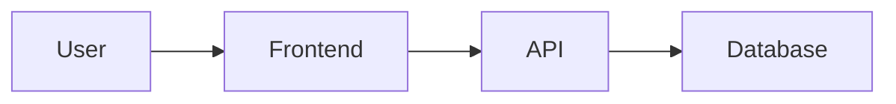

# Feature Documentation Templates

**Status**: ✅ Active Reference (v2.1 - CaaS Pattern)
**Last Updated**: 2025-12-15
**Purpose**: Standard templates and patterns for creating v2 feature documentation
**Architecture**: Hybrid Descriptive Approach with Minimal Code Blocks

## Change Log

| Date | Version | Description |
|------|---------|-------------|
| 2025-12-15 | v2.1 | Updated with CaaS v5.9 patterns - header structure, code minimization, cleanup guidance |
| 2025-12-14 | v2.0 | Initial hybrid descriptive approach templates |

---

## Overview

This directory contains templates and best practices for documenting TutorWise features using the **v2 hybrid descriptive approach**. These standards ensure consistency across all feature documentation and maximize AI code generation accuracy.

---

## Documentation Philosophy

### v2 Hybrid Descriptive Approach

**Key Principles**:
1. **WHY over HOW**: Explain design decisions and business context, not just implementation
2. **Conceptual over Code-Heavy**: Use worked examples and explanations instead of code blocks
3. **Role-Based Navigation**: Different reading paths for PMs, Engineers, and AI assistants
4. **Code-First Review**: Always verify code reality before documenting

**Code Block Reduction Target**: 60-70% fewer code blocks than v1 documentation

---

## Required Documentation Set (v2.1 - CaaS Pattern)

For every feature, create these 4 documents (and only these 4):

| # | Document | Lines | Code Blocks | Purpose | Audience |
|---|----------|-------|-------------|---------|----------|
| 1 | **README.md** | ~400 | 0 | Navigation hub + status + changelog | All roles |
| 2 | **[feature]-solution-design-v2.md** | ~1,500 | <5 | Architecture + business context + design decisions | PM, Engineers |
| 3 | **[feature]-implementation-v2.md** | ~800 | Unlimited | Developer patterns + code examples + testing | Engineers |
| 4 | **[feature]-prompt-v2.md** | ~600 | 0 | AI assistant constraints + patterns + gotchas | AI assistants |

**Important**: Status and implementation progress belong in README header, not separate files

**Clean Structure Example** (CaaS v5.9):
```
docs/feature/caas/
├── README.md                        (navigation + status)
├── caas-solution-design-v2.md      (architecture <5 code blocks)
├── caas-implementation-v2.md        (developer guide with code)
└── caas-prompt-v2.md               (AI context, 0 code blocks)
```

**What NOT to Create**:
- ❌ `IMPLEMENTATION_STATUS.md` (put in README header)
- ❌ `[feature]-audit.md` (merge findings then delete)
- ❌ `[feature]-hardening-plan.md` (merge into solution design)
- ❌ `[feature]-v1.md` files (delete after v2 is complete)

---

## Template Files

### Core Templates
- [feature-solution-design.md](./feature-solution-design.md) - Solution design template (v1 - needs update)
- [feature-implementation.md](./feature-implementation.md) - Implementation guide template (empty - needs creation)
- [feature-prompt.md](./feature-prompt.md) - AI prompt template (empty - needs creation)
- [feature-code-doc-review.md](./feature-code-doc-review.md) - Documentation review template

### Supporting Resources
- [references-section-template.md](./references-section-template.md) - Comprehensive file references template
- [diagram-examples.md](./diagram-examples.md) - Clean diagram patterns (Mermaid + ASCII-safe)

---

## How to Use These Templates

### Step 1: Code-First Analysis (REQUIRED)

**Before writing any documentation**, analyze the actual code:

```bash
# 1. Find all feature code files
find apps/web/src -name "*[feature-name]*" -type f

# 2. Check database migrations
ls -la apps/api/migrations/ | grep [feature]

# 3. Check API routes
find apps/web/src/app/api -name "*[feature]*"

# 4. Check components
find apps/web/src/app/components -name "*[feature]*"
```

**Critical**: Code is the source of truth. Never trust documentation alone.

---

### Step 2: Create README First

1. Copy template structure
2. Add feature overview (2-3 paragraphs from code analysis)
3. Add implementation status (based on actual code)
4. Create role-based navigation paths
5. Build document index table

**Purpose**: Navigation hub that guides all readers

---

### Step 3: Create Solution Design v2

1. Use hybrid descriptive approach
2. Focus on WHY (design decisions) over HOW (code)
3. Include worked examples for complex concepts
4. Add decision matrices for architectural choices
5. Minimize code blocks (target: 5-8 blocks total)

**Purpose**: Explain architecture and business context

---

### Step 4: Create Implementation Guide v2

1. Focus on patterns over specific code
2. Use "How to Add..." step-by-step guides
3. Include common pitfalls & solutions
4. Add integration patterns
5. Testing strategies

**Purpose**: Enable developers to extend the system

---

### Step 5: Create AI Prompt v2

1. Quick reference tables (types, methods, etc.)
2. Comprehensive DO/DON'T section with rationale
3. Minimal code blocks (5 examples max)
4. File references for deeper exploration
5. Performance best practices

**Purpose**: Maximize AI code generation accuracy

---

## Diagram Recommendations for v2 Documentation

### Use Simple Text-Based Diagrams

Instead of complex ASCII box-drawing characters (which cause formatting issues), use simple text:

```
User Flow:
1. User clicks button
2. Frontend validates input
3. API processes request
4. Database stores data
5. Success response returned
```

### Use Mermaid Diagrams (Recommended)

GitHub and most markdown renderers support Mermaid:

````markdown

````

**Benefits**:
- [YES] Clean rendering
- [YES] Version control friendly
- [YES] Easy to edit
- [YES] No encoding issues

### Box-Drawing Characters: Pragmatic Approach

**Current Practice in v2 Docs**:
- Existing v2 docs (CaaS, Profile Graph) use box-drawing unicode characters (┌, │, ─) for visual hierarchy
- These create "UTF-8 text" files instead of "ASCII text" files
- They render correctly in most modern editors and GitHub

**Recommendations**:
- **For new documentation**: Prefer Mermaid diagrams or simple text-based flows
- **For existing documentation**: Box-drawing characters are acceptable if they add significant visual clarity
- **Avoid in templates**: Keep templates ASCII-safe to prevent encoding issues across different systems

**ALWAYS avoid**:
- Emoji in documentation (renders as garbage in some editors)
- Special symbols that require specific UTF-8 encoding

**DO use**:
- Simple ASCII text: [YES]/[NO], [OK]/[ERROR]
- Basic arrows: ->, <-, |, --
- Simple indentation and numbered lists
- Mermaid diagrams for complex visualizations (RECOMMENDED)
- Box-drawing characters sparingly for visual hierarchy (if needed)

---

## Best Practices

### 1. Code-First Review Process

**Always**:
1.  Analyze code files FIRST
2.  Compare documentation to code reality
3.  Update outdated documentation
4.  Mark outdated docs as deprecated

**Never**:
- Trust documentation without verifying code
- Write docs before checking implementation
- Leave outdated docs without deprecation notice

---

### 2. Role-Based Navigation

**README must include navigation for**:
- **Product Managers**: 20-30 min read path (business context)
- **Backend Engineers**: 1-2 hour read path (full architecture)
- **AI Assistants**: 10-15 min read path (quick reference)

---

### 3. Documentation Versioning

**v2 = Recommended** (Hybrid descriptive, WHY-focused)
- Mark with star symbol in README
- Use `-v2.md` suffix

**v1 = Legacy** (Code-heavy reference)
- Mark with legacy symbol in README
- Keep for backward compatibility
- Add deprecation notice

---

### 4. Code Block Guidelines (CaaS v5.9 Pattern)

**IMPORTANT**: ASCII diagrams (DFD, sequence, flowcharts, UI layouts) are NOT code blocks! They are visual architecture documentation and should be included liberally in solution design documents.

**Document-Specific Targets** (based on CaaS exemplar):

**README.md**: 0 code blocks
- Use inline code references: `Math.round((rawTotal / 110) * 100)`
- Describe formulas in prose with inline math notation
- File references as markdown links: [tutor.ts:320-349](path/to/file.ts#L320-L349)
- ✅ ASCII diagrams allowed (not counted as code blocks)

**Solution Design**: <5 actual code blocks
- ✅ **ASCII diagrams encouraged** (DFD, sequence, flowcharts, UI layouts)
- ✅ Tables for scoring matrices and decision flows
- ❌ Only <5 actual code blocks (TypeScript, SQL, React snippets)
- Write algorithms as prose with worked examples
- Reference implementation doc for actual code

**What counts as a code block vs diagram**:
- ✅ **Not code blocks**: ASCII diagrams, tables, markdown formatting
- ❌ **Code blocks**: TypeScript, JavaScript, SQL, Python, shell scripts, JSON, YAML

**Prompt (AI Assistant Context)**: 0 code blocks
- Fully descriptive AI guidance
- Formulas written as prose
- Reference implementation doc at bottom for code needs
- Focus on constraints, patterns, and gotchas

**Implementation**: Unlimited code blocks
- This is where ALL code examples belong
- Full TypeScript/SQL/React snippets
- Testing code and examples
- Migration scripts and verification queries

**When to use descriptions instead of code** (everywhere except Implementation):
- Full API implementations → describe pattern + reference file
- Complete component code → explain structure + link to component
- Utility function implementations → describe purpose + reference
- Test cases → describe coverage + reference test file
- Configuration files → list key settings descriptively

---

### 5. Documentation Cleanup & Technical Debt (CaaS Pattern)

**When Updating Documentation to v2**:

1. **Merge Related Documents**: Don't keep separate files for closely related content
   - Example: CaaS merged `caas-hardening-plan.md` into security section of solution design
   - Rationale: Keeps all architecture + security discussion in one place

2. **Delete Old Versions Completely**: No "backup" or "old" files
   - Delete: `feature-solution-design.md` (v1)
   - Keep: `feature-solution-design-v2.md` only
   - Rationale: Git history preserves old versions, no need for clutter

3. **Delete Status Files**: Status belongs in README header
   - Delete: `IMPLEMENTATION_STATUS.md`
   - Move: Status info to README header with changelog
   - Rationale: Single source of truth for feature status

4. **Delete Audit/Review Files After Merging**: Reviews are point-in-time, merge findings then delete
   - Delete: `feature-solution-design-audit.md` after incorporating feedback
   - Rationale: Audit findings merged into main docs, review file is now stale

**CaaS v5.9 Cleanup Example**:
- ❌ Deleted: `caas-hardening-plan.md` (merged into solution design security section)
- ❌ Deleted: `caas-implementation-status-v5.5.md` (status moved to README)
- ❌ Deleted: `caas-implementation.md` (v1, replaced by v2)
- ❌ Deleted: `caas-solution-design-audit.md` (findings incorporated)
- ❌ Deleted: `caas-solution-design.md` (v1, replaced by v2)
- ✅ Kept: 4 clean v2 files (README, solution-design-v2, implementation-v2, prompt-v2)

**Result**: Zero technical debt, clear structure, easy navigation

---

### 6. Documentation Review Standards

**Documentation Review Must**:
1. Analyze code files FIRST (primary source of truth)
2. Compare documentation accuracy vs code
3. Identify outdated claims
4. Recommend updates or new docs
5. Include meta-analysis for maintainers

**Documentation Review is NOT**:
- Feature overview (that goes in README)
- Implementation status (that goes in README)
- User-facing documentation

---

## Examples

### ⭐ Gold Standard: CaaS v5.9 Documentation

**Location**: `docs/feature/caas/`

**Why This is the Exemplar**:
- **Structure**: 4 clean v2 documents (README, solution-design-v2, implementation-v2, prompt-v2)
- **Header Pattern**: Changelog at top, version info prominent, status indicator
- **Code Minimization**:
  - README: 0 code blocks (fully descriptive)
  - Solution Design: <5 code blocks (conceptual focus)
  - Prompt: 0 code blocks (AI assistant guidance)
  - Implementation: Full code examples (where they belong)
- **Cleanup**: Removed 5 deprecated files (hardening plan merged, v1 docs deleted)
- **Documentation Hygiene**: Zero technical debt, clear versioning

**Files to Study**:
1. [caas/README.md](../caas/README.md) - Perfect navigation hub with zero code
2. [caas/caas-solution-design-v2.md](../caas/caas-solution-design-v2.md) - Descriptive architecture with minimal code
3. [caas/caas-prompt-v2.md](../caas/caas-prompt-v2.md) - AI context with no code blocks
4. [caas/caas-implementation-v2.md](../caas/caas-implementation-v2.md) - Implementation report with full code examples

**Key Patterns to Copy**:
- Changelog in header (not footer)
- Status indicators (✅ Active, 🔄 In Progress, etc.)
- Normalization formula written as prose in design doc, shown as code in implementation
- Security/hardening content merged into solution design (not separate file)
- Deprecated files removed completely (no "old" or "backup" files)

### Good Example: Profile Graph v2 Documentation

**Location**: `docs/feature/profile-graph/`

**Documents**: 4 v2 docs (README, solution-design, implementation, prompt)
**Code blocks**: Reduced from 30 to 10 (67% reduction)
**Style**: Pattern-focused with decision matrices

---

## Common Mistakes to Avoid

### Mistake 1: Believing Documentation Over Code
**Problem**: IMPLEMENTATION_STATUS.md claimed 30% complete, code was 80-90% complete

**Solution**: Always run code analysis first

---

### Mistake 2: Too Many Documentation Files
**Problem**: Creating separate files for feature overview, status, etc.

**Solution**: Put overview and status in README

---

### Mistake 3: Code-Heavy Documentation
**Problem**: Copying entire implementations into docs

**Solution**: Use worked examples and file references instead

---

### Mistake 4: No Role-Based Navigation
**Problem**: Everyone reads the same 2,000-line document

**Solution**: Create reading paths for different roles

---

---

## Questions?

**For template questions**: Study CaaS v5.9 documentation as gold standard exemplar
**For feature-specific questions**: Read the feature's README.md
**For best practices**: This README + CaaS examples

---

**Document Version**: v2.1
**Last Reviewed**: 2025-12-15
**Next Review**: When new documentation patterns emerge
**Maintained By**: Documentation Standards Team
**Exemplar Reference**: [CaaS v5.9 Documentation](../caas/README.md)
