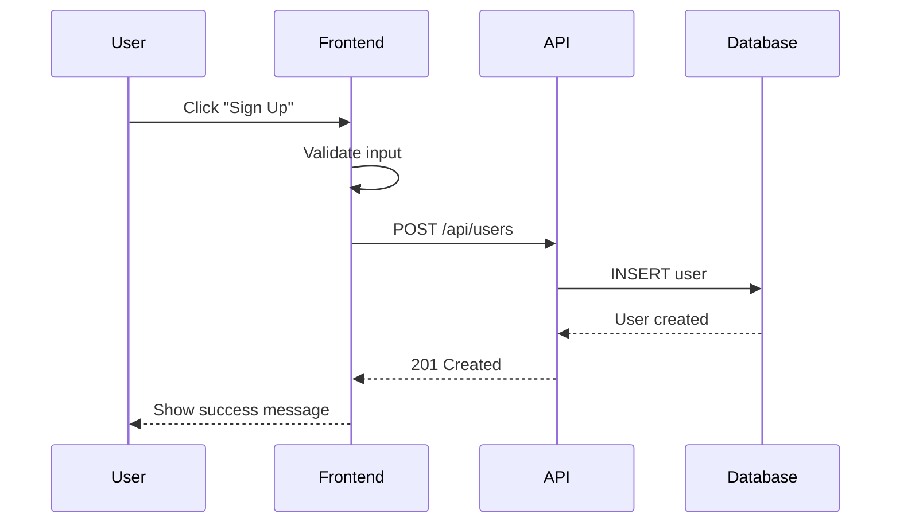
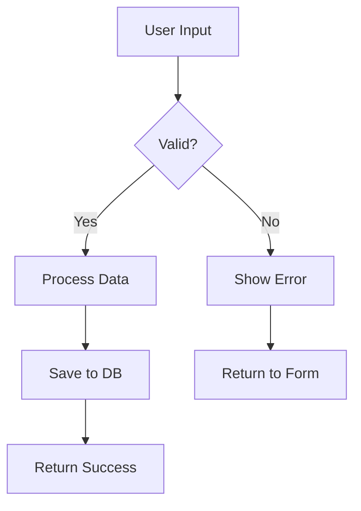
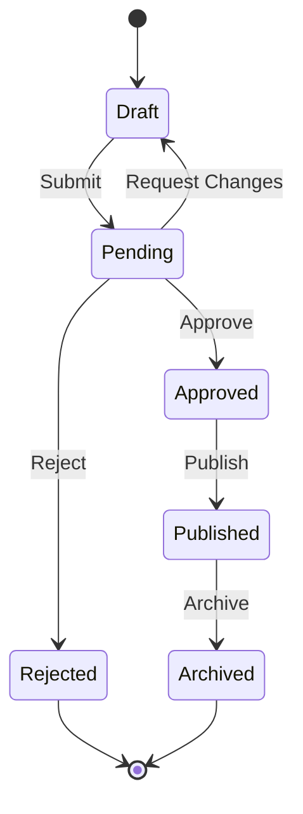
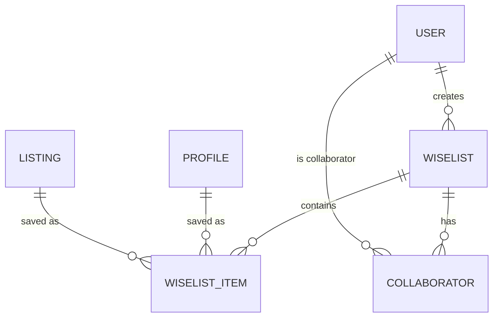

# Diagram Examples for v2 Documentation

**Purpose**: Simple, clean diagram patterns for solution design documents
**Version**: v2.0 (ASCII-safe, no special characters)
**Last Updated**: 2025-12-14

---

## Table of Contents
1. [Simple Text Flows](#simple-text-flows)
2. [Mermaid Diagrams](#mermaid-diagrams-recommended)
3. [ASCII-Safe Sequence Diagrams](#ascii-safe-sequence-diagrams)
4. [State Transitions](#state-transitions)
5. [Component Hierarchies](#component-hierarchies)

---

## Philosophy

**v2 Approach**: Prefer clarity over complexity. Use simple text or Mermaid diagrams instead of complex ASCII art.

**Why**:
- No encoding issues
- Renders correctly in all editors
- Easy to maintain
- Version control friendly

---

## Simple Text Flows

### User Flow Example

```
User Registration Flow:

1. User visits /signup
2. Enters email and password
3. System validates input
4. System creates account
5. System sends verification email
6. User clicks verification link
7. Account is activated
```

**When to use**: Simple sequential processes

---

### Data Flow Example

```
API Request Flow:

Browser -> Frontend Validation
  |
  v
Frontend -> API Gateway (/api/users)
  |
  v
API Gateway -> Service Layer (createUser)
  |
  v
Service Layer -> Database (INSERT)
  |
  v
Database -> Service Layer (new user record)
  |
  v
Service Layer -> API Gateway (success response)
  |
  v
API Gateway -> Frontend (user object)
  |
  v
Frontend -> Browser (redirect to /dashboard)
```

**When to use**: Multi-layer system flows

---

## Mermaid Diagrams (Recommended)

### Sequence Diagram

````markdown

````

**Renders as**: Professional sequence diagram with proper arrows

---

### Flow Chart

````markdown

````

**When to use**: Decision trees, conditional logic

---

### State Diagram

````markdown

````

**When to use**: Status transitions, state machines

---

### Entity Relationship

````markdown

````

**When to use**: Database relationships

---

## ASCII-Safe Sequence Diagrams

### Simple Arrow Format

```
Authentication Flow:

User              Frontend           Auth Service        Database
 |                   |                    |                  |
 |--- Click Login -->|                    |                  |
 |                   |                    |                  |
 |                   |--- POST /login --->|                  |
 |                   |                    |                  |
 |                   |                    |--- Query User -->|
 |                   |                    |                  |
 |                   |                    |<-- User Data ----|
 |                   |                    |                  |
 |                   |                    |--- Hash Check    |
 |                   |                    |                  |
 |                   |<-- JWT Token ------|                  |
 |                   |                    |                  |
 |<-- Redirect ------|                    |                  |
 |   to /dashboard   |                    |                  |
```

**When to use**: When Mermaid is not available

---

## State Transitions

### Simple State Table

```
Booking State Machine:

PENDING
  |
  +-- (timeout) --> EXPIRED
  +-- (tutor accepts) --> CONFIRMED
  +-- (tutor declines) --> REJECTED

CONFIRMED
  |
  +-- (complete session) --> COMPLETED
  +-- (cancel) --> CANCELLED
  +-- (reschedule) --> PENDING

COMPLETED
  |
  +-- (after 30 days) --> ARCHIVED
```

**When to use**: State machines, status workflows

---

### State Transition List

```
Order Status Transitions:

State: DRAFT
  -> Can transition to: SUBMITTED (user action)

State: SUBMITTED
  -> Can transition to: PROCESSING (auto)
  -> Can transition to: CANCELLED (user action)

State: PROCESSING
  -> Can transition to: SHIPPED (fulfillment)
  -> Can transition to: FAILED (error)

State: SHIPPED
  -> Can transition to: DELIVERED (tracking)

State: DELIVERED
  -> Can transition to: COMPLETED (after 7 days)
```

**When to use**: Complex state transitions with conditions

---

## Component Hierarchies

### Tree Structure

```
App Component Tree:

App (Root)
|
+-- AuthProvider
|   +-- User Context
|
+-- Layout
|   |
|   +-- Header
|   |   +-- Logo
|   |   +-- Navigation
|   |   +-- UserMenu
|   |
|   +-- Main
|   |   +-- [Page Component]
|   |       +-- PageHeader
|   |       +-- PageContent
|   |       +-- PageActions
|   |
|   +-- Footer
|
+-- Modals (Portal)
    +-- ConfirmDialog
    +-- Notifications
```

**When to use**: Component hierarchies, file structures

---

### Indented List

```
File Structure:

apps/web/src/
  app/
    (authenticated)/
      wiselists/
        page.tsx              # Hub page
        [id]/
          page.tsx            # Detail page
    components/
      feature/
        wiselists/
          WiselistCard.tsx    # Main card component
          WiselistModal.tsx   # Create/edit modal
    api/
      wiselists/
        route.ts              # GET/POST /api/wiselists
        [id]/
          route.ts            # GET/PATCH/DELETE /api/wiselists/[id]
  lib/
    api/
      wiselists.ts            # Service layer functions
  types/
    index.ts                  # TypeScript interfaces
```

**When to use**: File structures, nested configurations

---

## Architecture Diagrams

### Layer Architecture

```
System Architecture (3-Tier):

+------------------+
| Presentation     |  Next.js Pages, React Components
| Layer            |
+------------------+
         |
         v
+------------------+
| Application      |  API Routes, Server Actions
| Layer            |  Business Logic
+------------------+
         |
         v
+------------------+
| Data Layer       |  Supabase Client, RLS Policies
|                  |  PostgreSQL Database
+------------------+
```

**When to use**: High-level architecture

---

### Integration Points

```
Feature Integration Map:

Wiselists (Core Feature)
  |
  +-- Integrates with: Referrals
  |   Purpose: Send invite links when adding collaborators
  |   Method: API call to generate referral code
  |
  +-- Integrates with: Profile Graph
  |   Purpose: Create SOCIAL link for invited users
  |   Method: Database trigger on signup
  |
  +-- Integrates with: Payments
  |   Purpose: Track booking attribution
  |   Method: Middleware stores referrer_id in session
  |
  +-- Integrates with: CaaS
      Purpose: Update tutor search ranking
      Method: Queue recalculation on item save
```

**When to use**: Feature dependencies, integration overview

---

## DO's and DON'Ts

### [YES] Recommended (Preferred)

- **Mermaid diagrams**: For complex visualizations (BEST CHOICE)
- **Simple ASCII**: arrows (->), pipes (|), dashes (--)
- **Indented lists**: For hierarchies
- **Numbered steps**: For sequential processes
- **Tables**: For comparisons and mappings

### [ACCEPTABLE] Use Sparingly

- **Unicode box characters** (┌, │, ─): Acceptable in feature docs if they add significant visual clarity
  - Note: Creates UTF-8 files instead of ASCII
  - Renders correctly in modern editors and GitHub
  - See CaaS v2 and Profile Graph v2 for examples

### [NO] Don't Use

- **Emoji**: Renders incorrectly in some editors
- **Complex multi-line ASCII art**: Hard to maintain, causes encoding issues
- **Special symbols requiring UTF-8**: Creates cross-platform compatibility issues

---

## Tools & Resources

### Recommended Tools

1. **Mermaid Live Editor**: https://mermaid.live
   - Create diagrams visually
   - Export as markdown
   - Preview in real-time

2. **Plain Text Editors**:
   - VS Code (with Mermaid preview extension)
   - Any monospace editor for ASCII diagrams

3. **Documentation**:
   - Mermaid Documentation: https://mermaid.js.org/
   - GitHub Markdown Guide: https://guides.github.com/features/mastering-markdown/

---

## Quick Reference

### Common Arrows (ASCII-safe)

```
-->   Right arrow
<--   Left arrow
<-->  Bidirectional
|     Vertical pipe
+     Junction
^     Up arrow
v     Down arrow
```

### Common Patterns

**Sequential Flow**:
```
A -> B -> C -> D
```

**Branching**:
```
A -> B
     |
     +-> C
     +-> D
```

**Cycle**:
```
A -> B -> C
^         |
|         v
+-------- D
```

---

**Document Version**: v2.0
**Last Updated**: 2025-12-14
**Maintainer**: Documentation Team

---

**Remember**: The goal is **clarity**, not artistic complexity. Choose the simplest diagram that communicates your point effectively!
